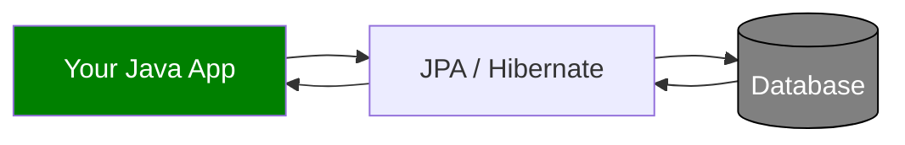
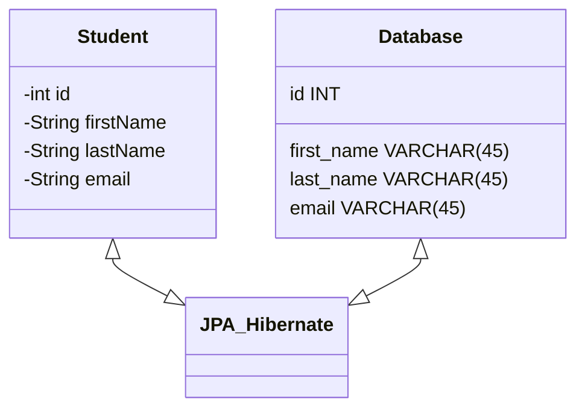
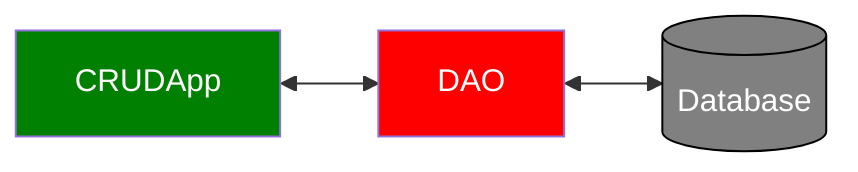
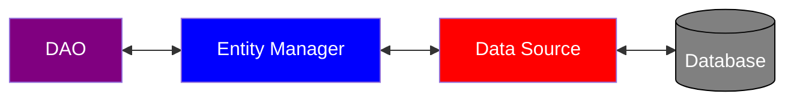
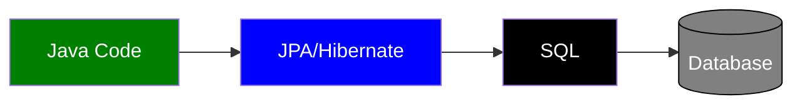

# Hibernate | JPA CRUD

## Hibernate

- **Hibernate**: A framework for persisting / saving Java objects in a database
- Hibernate handles all of the low-level SQL
- Minimizes the amount of JDBC code you have to develop
- Hibernate provides the Object-to-Relational Mapping (ORM)



## Object-To-Relational Mapping (ORM)



## JPA

- **JPA** is Jakarta Persistence API
  - Standard API for Object-to-Relational-Mapping (ORM)
- Only a specification
  - Defines a set of interfaces
  - Requires an implementation to be usable
- Benefits:
  - By having a standard API, you are not locked to vendor's implementation
  - Maintain portable, flexible code by coding to JPA spec (interfaces)
  - Can theoretically switch vendor implementations
    - For example, if Vendor ABC stops supporting their product
    - You could switch to Vendor XYZ without vendor lock in
- Hibernate is the default implementation in Spring Boot
  - JPA term used interchangebly with Hibernate

### EntityManager

- In Spring Boot, Hibernate is the default implementation of JPA
- `EntityManager` is main component for creating queries etc …
- `EntityManager` is from Jakarta Persistence API (JPA)
- `EntityManager` is used for low-level control and flexibility.
  - Later, we will use `JpaRepository` for high-level of abstraction coding.

### Saving a Java Object with JPA

```js
// create Java object
Student theStudent = new Student("Paul", "Doe", "paul@luv2code.com");

// entityManager is a special JPA helper object
// the persist method is used to save theStudent to database
// the persist method is equivalent to the SQL insert
entityManager.persist(theStudent);
```

### Retrieving a Java Object with JPA

```js
// create Java object
Student theStudent = new Student("Paul", "Doe", "paul@luv2code.com");

// save it to database
entityManager.persist(theStudent);

// now retrieve from database using the primary key
// the find method will query the database for a given id
int theId = 1;
Student myStudent = entityManager.find(Student.class, theId);
```

### Querying for Java Objects

```js
TypedQuery<Student> theQuery = entityManager.createQuery("from Student", Student.class);

// the getResultList method returns a list of Student objects from the database
List<Student> students= theQuery.getResultList();
```

### Hibernate / JPA & JDBC

Hibernate / JPA uses JDBC for all database communications

### Creating Spring Boot - Command Line App

```js
import org.springframework.boot.CommandLineRunner;
import org.springframework.boot.SpringApplication;
import org.springframework.boot.autoconfigure.SpringBootApplication;
import org.springframework.context.annotation.Bean;

@SpringBootApplication
public class CruddemoApplication {

    //Executed after the Spring Beans have been loaded
    public static void main(String[] args) {
        SpringApplication.run(CruddemoApplication.class, args);
    }

    @Bean
    public CommandLineRunner commandLineRunner(String[] args) {
        //Lambda expression runs your custom code
        return runner -> {
            System.out.println("Hello world");
        };
}
}
```

## Entity Class

**Entity Class**: Java class that is mapped to a database table

### @Entity

- Must have a public or protected no-argument constructor
- The class can have other constructors

## Java Annotations

1. Map class to database table

```js
//@Entity annotation is needed to map Student to MySQL student database table
@Entity
@Table(name="student")
public class Student {
    ...
}
```

2. Map fields to database columns

```js
@Entity
@Table(name="student")
public class Student {
    //@Column annotation maps id to the id in the database table
    @Id
    @Column(name="id")
    private int id;

    //@Column annotation maps firstName to the first_name in the database table
    @Column(name="first_name")
    private String firstName;
}
```

### @Column

- `@Column` is optional
  - If not used, then column name is the same name as java field
    :::tip
    Better to specify with `@Column` just to be safe.
    :::

### @Table

- `@Table` is optional
  - If not used, then the database table name is same as the class.
    :::tip
    Better to specify with `@Table` just to be safe.
    :::

## Primary Key

- Uniquely identifies each row in a table
- Must be a unique value
- Cannot contain NULL values

Example in MySQL:

```
CREATE TABLE student (
    id int NOT NULL AUTO_INCREMENT,
    first_name varchar(45) DEFAULT NULL,
    last_name varchar(45) DEFAULT NULL,
    email varchar(45) DEFAULT NULL,
    PRIMARY KEY (id)
)
```

### JPA Identity - Primary Key

```js
@Entity
@Table(name="student")
public class Student {
    //GenerationType.IDENTITY designates a primary key
    @Id
    @GeneratedValue(strategy=GenerationType.IDENTITY)
    @Column(name="id")
    private int id;
}
```

## Data Access Object

- Data Acess Object (DAO) is a design pattern



- A DAO requires a JPA entity manager
  - Entity manager is needed to save or retrieve entities
  - Entity manager needs a data source.
  - **Data Source**: defines the database connection info
  - **application.properties** automatically creates the Entity Manager and Data Source.
  - The developer autowrites and injects the JPA Entity Manager into the DAO.



### @Transactional

- Automagically begin and end a transaction for your JPA code
  - No need for you to explicitly do this in your code

### @Repository

- Applied to DAO implementations
- Spring will automatically register the DAO implementation due to component-scanning
- Spring also provides translation of any JDBC related exceptions

### Student DAO Example - Create Objects

1. Define DAO interface

```js
import com.luv2code.cruddemo.entity.Student;

public interface StudentDAO {
    void save(Student theStudent);
}
```

2. Define DAO implementation
   - Inject the entity manager

```js
import com.luv2code.cruddemo.entity.Student;
import jakarta.persistence.EntityManager;
import org.springframework.beans.factory.annotation.Autowired;
import org.springframework.stereotype.Repository;
import org.springframework.transaction.annotation.Transactional;

// @Repository annotation supports component scanning and translates JDBC exceptions
@Repository
public class StudentDAOImpl implements StudentDAO {
    private EntityManager entityManager;

    // Inject the Entity Manager
    @Autowired
    public StudentDAOImpl(EntityManager theEntityManager) {
        entityManager = theEntityManager;
    }

    // Save the Java Object
    // @Transactional annotation handles transaction management
    @Override
    @Transactional
    public void save(Student theStudent) {
        entityManager.persist(theStudent);
    }
}
```

3. Update the main app

```js
@SpringBootApplication
public class CruddemoApplication {

    public static void main(String[] args) {
        SpringApplication.run(CruddemoApplication.class, args);
    }

    //Inject the StudentDAO
    @Bean
    public CommandLineRunner commandLineRunner(StudentDAO studentDAO) {
    return runner -> {
        createStudent(studentDAO);
    }

    private void createStudent(StudentDAO studentDAO) {
        // create the student object
        System.out.println("Creating new student object...");
        Student tempStudent = new Student("Paul", "Doe", "paul@luv2code.com");

        // save the student object
        System.out.println("Saving the student...");
        studentDAO.save(tempStudent);

        // display id of the saved student
        System.out.println("Saved student. Generated id: " + tempStudent.getId());
    }
}
```

### Retrieving a Java Object with JPA

```js
// retrieve/read from database using the primary key
// in this example, retrieve the Entity Class, Student, with primary key: 1
Student myStudent = entityManager.find(Student.class, 1);
```

### Student DAO Example - Read Objects part 1

1. Add new method to DAO interface

```js
import com.luv2code.cruddemo.entity.Student;
public interface StudentDAO {
    /* Create Object methods here from earlier */

    ...

    Student findById(Integer id);
}
```

2. Add new method to DAO implementation

```js
import com.luv2code.cruddemo.entity.Student;
import jakarta.persistence.EntityManager;
/* Create Object imports here from earlier */
...

public class StudentDAOImpl implements StudentDAO {
    private EntityManager entityManager;

    /* Other code from Create Object step goes here from earlier */
    ...

    // Note: Notice there is no need to add @Transactional since we are doing a query
    // returns null if not found
    @Override
    public Student findById(Integer id) {
        return entityManager.find(Student.class, id);
    }
}
```

3. Update main app

```js
@SpringBootApplication
public class CruddemoApplication {

    /* Earlier code from Create Objects step goes here */
    ...

    //Inject the StudentDAO
    @Bean
    public CommandLineRunner commandLineRunner(StudentDAO studentDAO) {
    return runner -> {
        readStudent(studentDAO);
    }

private void readStudent(StudentDAO studentDAO) {
    // create a student object
    System.out.println("Creating new student object...");
    Student tempStudent = new Student("Daffy", "Duck", "daffy@luv2code.com");

    // save the student object
    System.out.println("Saving the student...");
    studentDAO.save(tempStudent);

    // display id of the saved student
    System.out.println("Saved student. Generated id: " + tempStudent.getId());

    // retrieve student based on the id: primary key
    System.out.println("\nRetrieving student with id: " + tempStudent.getId());
    Student myStudent = studentDAO.findById(tempStudent.getId());
    System.out.println("Found the student: " + myStudent);
}
}
```

### JPA Query Language (JPQL)

- Query language for retrieving objects
- Similar to SQL
- However, JPQL is based on _entity name_ and _entity fields_

#### Retrieving all Students example

```js
// Student in "FROM Student" is the name of a JPA Entity (class name of Student in Java)
// "Student" is NOT the name of the database table.
TypedQuery<Student> theQuery = entityManager.createQuery("FROM Student", Student.class);
List<Student> students = theQuery.getResultList();
```

#### Retrieving Students: lastName = 'Doe' example

```js
// lastName is the field of the JPA Entity (lastName is a member field of the Student Java Class)
TypedQuery<Student> theQuery = entityManager.createQuery("FROM Student WHERE lastName=‘Doe’", Student.class);
List<Student> students = theQuery.getResultList();
```

### JPQL - Named Parameters

```js
public List<Student> findByLastName(String theLastName) {
    //JPQL Named Parameters are prefixed with a colon :
    //Think of theData as a placeholder that is filled in later
    TypedQuery<Student> theQuery = entityManager.createQuery("FROM Student WHERE lastName=:theData", Student.class);

    //Now theData is filled in
    theQuery.setParameter("theData", theLastName);

    return theQuery.getResultList();
}
```

### JPQL - select clause

- For strict JPQL, the “select” clause is required

```js
// s is an “identification variable” / alias
// Provides a reference to the Student entity object
// s - Can be any name
// Useful for when you have complex queries
TypedQuery<Student> theQuery = entityManager.createQuery("select s FROM Student s", Student.class);
```

### Student DAO Example - Read Objects part 2

1. Add new method to DAO interface

```js
import com.luv2code.cruddemo.entity.Student;
import java.util.List;
public interface StudentDAO {
    /* Other DAO methods written here*/
    ...

    List<Student> findAll();
}
```

2. Add new method to DAO implementation

```js
import com.luv2code.cruddemo.entity.Student;
import jakarta.persistence.EntityManager;
import jakarta.persistence.TypedQuery;
import java.util.List;
/* Other DAO imports here */
...

public class StudentDAOImpl implements StudentDAO {
    private EntityManager entityManager;

    /* Other DAO implementations here */
    ...

    // Note: No need to add @Transactional since we are doing a query
    // Student in "FROM Student" is the name of the JPA entity (java class Student)
    @Override
    public List<Student> findAll() {
        TypedQuery<Student> theQuery = entityManager.createQuery(“FROM Student", Student.class);
        return theQuery.getResultList();
    }
}
```

3. Update main app

```js
@SpringBootApplication
public class CruddemoApplication {

    public static void main(String[] args) {
        SpringApplication.run(CruddemoApplication.class, args);
    }

    @Bean
    public CommandLineRunner commandLineRunner(StudentDAO studentDAO) {
        return runner -> {
            queryForStudents(studentDAO);
        };
    }

    private void queryForStudents(StudentDAO studentDAO) {
        // get list of students
        List<Student> theStudents = studentDAO.findAll();

        // display list of students
        for (Student tempStudent : theStudents) {
            System.out.println(tempStudent);
        }
    }
}
```

### Updating a Java Object with JPA

```js
Student theStudent = entityManager.find(Student.class, 1);

// change first name to "Scooby"
theStudent.setFirstName("Scooby");

//Update the entity
entityManager.merge(theStudent);
```

#### Update last name for all students example

```js
//Objective: return the number of rows updated
//lastName is the field of the JPA entity
//Student is the name of the JPA Entity (Java class name)
//executeUpdate method will execute the statement
int numRowsUpdated = entityManager.createQuery("UPDATE Student SET lastName='Tester'”).executeUpdate();
```

### Student DAO Example - Update Objects

1. Add new method to DAO interface

```js
import com.luv2code.cruddemo.entity.Student;

public interface StudentDAO {
    /* Other DAO methods */
    ...

    void update(Student theStudent);
}
```

2. Add new method to DAO implementation

```js
import com.luv2code.cruddemo.entity.Student;
import jakarta.persistence.EntityManager;
import org.springframework.transaction.annotation.Transactional;
/* Other DAO imports go here */
...

public class StudentDAOImpl implements StudentDAO {
    private EntityManager entityManager;
    /* Other DAO implementations go here */
    ...

    // Add @Transactional since we are performing an update
    @Override
    @Transactional
    public void update(Student theStudent) {
        entityManager.merge(theStudent);
    }
}
```

3. Update main app

```js
@SpringBootApplication
public class CruddemoApplication {
    /*Other DAO Application code*/
    ...

    @Bean
    public CommandLineRunner commandLineRunner(StudentDAO studentDAO) {
    return runner -> {
        updateStudent(studentDAO);
    };

    private void updateStudent(StudentDAO studentDAO) {
        // retrieve student based on the id: primary key
        int studentId = 1;
        System.out.println("Getting student with id: " + studentId);
        Student myStudent = studentDAO.findById(studentId);
        System.out.println("Updating student...");

        // change first name to "Scooby"
        myStudent.setFirstName("Scooby");
        studentDAO.update(myStudent);

        // display updated student
        System.out.println("Updated student: " + myStudent);
    }
}

```

### Deleting a Java Object with JPA

```js
// retrieve the student
int id = 1;
Student theStudent = entityManager.find(Student.class, id);

// delete the student
entityManager.remove(theStudent);
```

#### Delete based on a condition

```js
//Objective: return the number of rows deleted
// lastName is the field of JPA entity
// Student is the name of the JPA entity (java class name)
// executeUpdate method is needed to execute the statement since the database is being modified (i.e. deleted).
int numRowsDeleted = entityManager.createQuery("DELETE FROM Student WHERE lastName=‘Smith’").executeUpdate();
```

### Student DAO Example - Delete Objects

1. Add new method to DAO interface

```js
import com.luv2code.cruddemo.entity.Student;

public interface StudentDAO {
    /* Other DAO methods */
    ...

    void delete(Integer id);
}
```

2. Add new method to DAO implementation

```js
import com.luv2code.cruddemo.entity.Student;
import jakarta.persistence.EntityManager;
import org.springframework.transaction.annotation.Transactional;
/* Other DAO imports go here */
...

public class StudentDAOImpl implements StudentDAO {
    private EntityManager entityManager;
    /* Other DAO implementations go here */
    ...

    // Add @Transactional since we are performing a delete
    @Override
    @Transactional
    public void delete(Integer id) {
        Student theStudent = entityManager.find(Student.class, id);
        entityManager.remove(theStudent);
    }
}
```

3. Update main app

```js
@SpringBootApplication
public class CruddemoApplication {
    /*Other DAO Application code*/
    ...

    @Bean
    public CommandLineRunner commandLineRunner(StudentDAO studentDAO) {
    return runner -> {
        deleteStudent(studentDAO);
    };

    private void deleteStudent(StudentDAO studentDAO) {
        // delete the student
        int studentId = 3;
        System.out.println("Deleting student id: " + studentId);
        studentDAO.delete(studentId);
    }
}

```

## Creating Database Tables from Java Code

- JPA/Hibernate provides an option to automagically create database tables
- Creates tables based on Java code with JPA/Hibernate annotations
- Though not recommend, check configuration for reasons why ...



### Configuration

:::danger

- In the **application.properties** file, do not include

```
spring.jpa.hibernate.ddl-auto=create
```

- When you run your app, JPA/Hibernate will drop tables then create them based on the JPA/Hibernate annotations in your Java code
- This means when database tables are dropped, all data is lost
- Do not do this in Production databases!
  :::

:::warning
If you want to create tables once and then keep data, use: update

```
spring.jpa.hibernate.ddl-auto=update
```

However, will ALTER database schema based on latest code updates.

Be VERY careful here ... only use for basic projects
:::

:::tip

- In general, don’t use auto generation for enterprise, real-time projects
  - You can VERY easily drop PRODUCTION data if you are not careful
- Use SQL scripts
  - Corporate DBAs prefer SQL scripts for governance and code review
  - The SQL scripts can be customized and fine-tuned for complex database designs
  - The SQL scripts can be version-controlled
  - Can also work with schema migration tools such as Liquibase and Flyway
    :::

### Student example

```js
@Entity
@Table(name="student")
public class Student {
    @Id
    @GeneratedValue(strategy=GenerationType.IDENTITY)
    @Column(name="id")
    private int id;

    @Column(name="first_name")
    private String firstName;

    @Column(name="last_name")
    private String lastName;

    @Column(name="email")
    private String email;

    …
    // constructors, getters / setters
}
```

:::note
The above java code is equivalent to the SQL down below
:::

```
create table student (id integer not null auto_increment,
email varchar(255),
first_name varchar(255),
last_name varchar(255),
primary key (id))
```

:::note

- Observe how @Table corresponds to the SQL table name of student
- All the @Column corresponds to the entries in the database.
  :::
