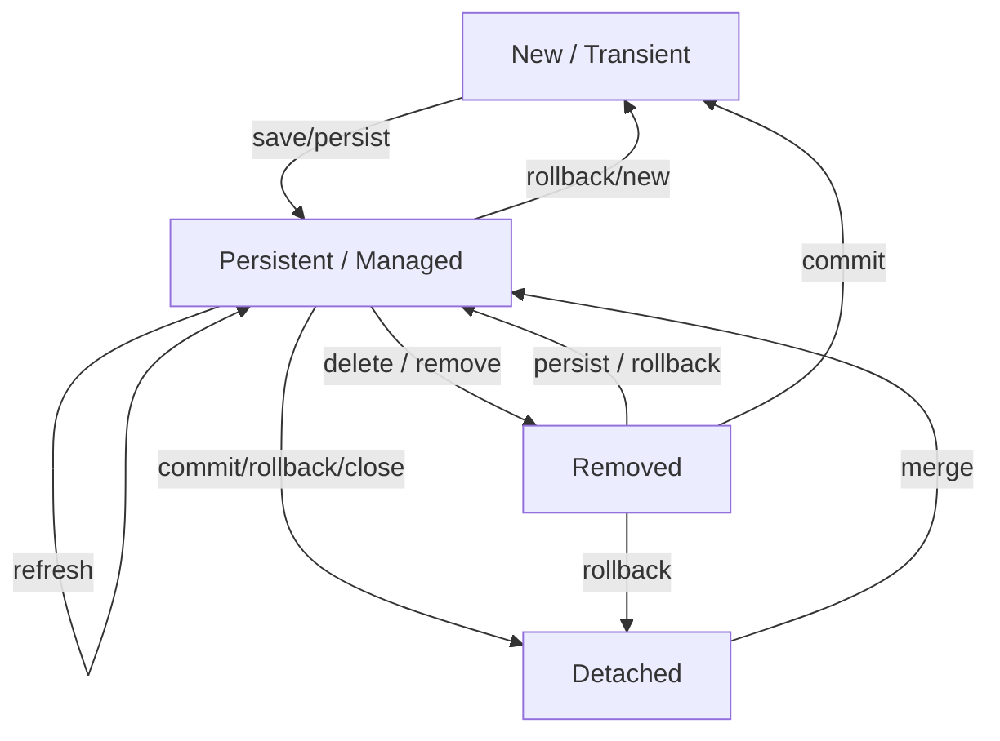
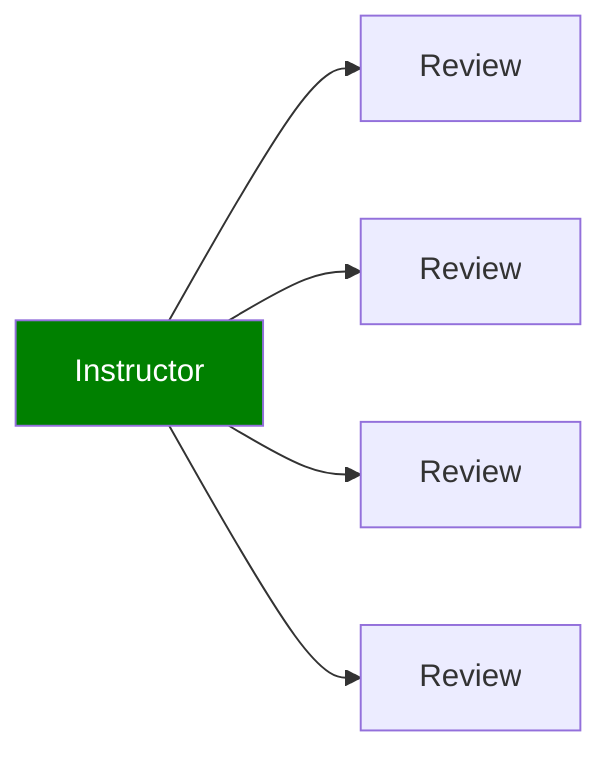

# JPA | Hibernate Advanced Mappings

## Advanced Mappings

- Advanced Mappings:

  - One-to-One

    ```mermaid
    flowchart LR

    A[Instructor] --> B[Instructor Detail]

    style A fill:green,color:white;
    style B fill:orange,color:white;
    ```

  - One-to-Many or Many-to-One

    ```mermaid
    flowchart LR

    A[Instructor] --> B[Course 1]
    A --> C[Course 2]
    A --> D[Course 3]
    A --> E[Course 4]

    style A fill:green,color:white;
    ```

  - Many-to-Many

    ```mermaid
    flowchart LR

    A[Student 1] --> B[Course 1]
    X[Student 2] --> C[Course 2]
    X --> B
    X --> C
    Y[Student 3] --> D[Course 3]
    Y --> B
    Z[Student 4] --> E[Course 4]
    Z --> D

    style A fill:green,color:white;
    style X fill:green,color:white;
    style Y fill:green,color:white;
    style Z fill:green,color:white;
    ```

### Databases Primary Key and Foreign Key

- **Primary key**: identify a unique row in a table
- **Foreign key**:
  - Link tables together
  - a field in one table that refers to primary key in another table
  - Main purpose is to preserve relationship between tables
    - Referential Integrity
  - Prevents operations that would destroy relationship
  - Ensures only valid data is inserted into the foreign key column
    - Can only contain valid reference to primary key in other table

### Cascade

- **cascade** operations
  - apply the same operation to related entities
- If we delete an instructor, we should also delete their instructor_detail
  - This is known as “CASCADE DELETE”

### Fetch Types: Eager vs Lazy Loading

- **Eager** will retrieve everything
- **Lazy** will retrieve on request

## One-to-One

**Development Process**:

1. Prep Work - Define database tables

**create-db.sql**

```
DROP SCHEMA IF EXISTS `hb-01-one-to-one-uni`;

CREATE SCHEMA `hb-01-one-to-one-uni`;

use `hb-01-one-to-one-uni`;

SET FOREIGN_KEY_CHECKS = 0;

DROP TABLE IF EXISTS `instuctor_detail`;

CREATE TABLE `instructor_detail` (
    `id` int(11) NOT NULL AUTO_INCREMENT,
    `youtube_channel` varchar(128) DEFAULT NULL,
    `hobby` varchar(45) DEFAULT NULL,
    PRIMARY KEY (`id`)
) ENGINE=InnoDB AUTO_INCREMENT=1 DEFAULT CHARSET=latin1;

DROP TABLE IF EXISTS `instuctor`;

CREATE TABLE `instructor` (
    `id` int(11) NOT NULL AUTO_INCREMENT,
    `first_name` varchar(45) DEFAULT NULL,
    `last_name` varchar(45) DEFAULT NULL,
    `email` varchar(45) DEFAULT NULL,
    `instructor_detail_id` int(11) DEFAULT NULL,
    PRIMARY KEY (`id`),
    KEY `FK_DETAIL_idx` (`instructor_detail_id`),
    CONSTRAINT `FK_DETAIL` FOREIGN KEY (`instructor_detail_id`)
    REFERENCES `instructor_detail` (`id`)
    ON DELETE NO ACTION ON UPDATE NO ACTION
) ENGINE=InnoDB AUTO_INCREMENT=1 DEFAULT CHARSET=latin1;
...
```

:::note

```
KEY `FK_DETAIL_idx` (`instructor_detail_id`),
CONSTRAINT `FK_DETAIL` FOREIGN KEY (`instructor_detail_id`)
REFERENCES `instructor_detail` (`id`)
ON DELETE NO ACTION ON UPDATE NO ACTION
```

- This part is the setup of the foreign key

  ```
  CONSTRAINT `FK_DETAIL` FOREIGN KEY (`instructor_detail_id`)
  REFERENCES `instructor_detail` (`id`)
  ```

  - will reference the instructor_detail table in the id column.
  - the instructor_detail_id column in the instructor table will be the foreign key that maps to the id column in instructor_detail table

:::

2. Create InstructorDetail class

**InstructorDetail.java**

```js
import jakarta.persistence.Entity;
import jakarta.persistence.Table;

// annotate the class as an entity and map to db table
@Entity
@Table(name="instructor_detail")
public class InstructorDetail {

    //annotate the fields with db column names
    @Id
    @GeneratedValue(strategy=GenerationType.IDENTITY)
    @Column(name="id")
    private int id;

    @Column(name="youtube_channel")
    private String youtubeChannel;

    @Column(name="hobby")
    private String hobby;

    // constructors
    public InstructorDetail(String youtubeChannel, String hobby){
        this.youtubeChannel = youtubeChannel;
        this.hobby = hobby;
    }

    ...

    // getters / setters
}
```

3. Create Instructor class

**Instructor.java**

```js
@Entity
@Table(name="instructor")
public class Instructor {
    @Id
    @GeneratedValue(strategy=GenerationType.IDENTITY)
    @Column(name="id")
    private int id;

    @Column(name="first_name")
    private String firstName;

    @Column(name="last_name")
    private String lastName;

    @Column(name="email")
    private String email;

    // instructor_detail_id is defined in instructor table
    // In database, foreign key is configured to reference id field in instructor_detail table
    @OneToOne
    @JoinColumn(name="instructor_detail_id")
    private InstructorDetail instructorDetail;

    // constructors
    public Instructor(String firstName, String lastName, String email){
        this.firstName = firstName;
        this.lastName = lastName;
        this.email = email;
    }

    ...
    // getters / setters
}
```

4. Create DAO interface

**AppDAO.java**:

```js
public interface AppDAO {
    void save(Instructor theInstructor);
}
```

5. Create DAO impl

**AppDAOImpl.java**:

```js
@Repository
public class AppDAOImpl implements AppDAO {
    //define field for entity manager
    private EntityManager entityManager;

    //inject entity manager using constructor injection
    @Autowired
    public AppDAOImpl(EntityManager entityManager){
        this.entityManager = entityManager;
    }

    //@Transactional is needed since we are persisting the entity (saving an object to the database)
    @Override
    @Transactional
    public void save(Instructor theInstructor){
        //This will also save the details object due to CascadeType.ALL
        entityManager.persist(theInstructor);
    }
}
```

6. Create Main App

**CruddemoApplication.java**

```js
@SpringBootApplication
public class CruddemoApplication{
    public static void main(String[] args){
        StringApplication
    }

    @Bean
    public CommandLineRunner commandLineRunner(AppDAO appDAO){
        return runner -> {
            createInstructor(appDAO);
        }
    }

    private void createInstructor(AppDAO appDAO){
        //create the instructor
        Instructor tempInstructor = new Instructor("Chad", "Darby", "darby@luv2code.com");

        //create the instructor detail
        InstructorDetail tempInstructorDetail = new InstructorDetail("http://www.luv2code.com/youtube", "Luv 2 code");

        //associate the objects
        tempInstructor.setInstructorDetail(tempInstructorDetail);

        //save the instructor
        // Note: this will also save the details object
        // due to CascadeType.ALL
        appDAO.save(tempInstructor);
    }
}
```

7. enable logging in **application.properties**:

```
# Show JPA/Hibernate logging messages
logging.level.org.hibernate.SQL=trace
logging.level.org.hibernate.orm.jdbc.bind=trace
```

### Entity Lifecycle

- **Detach**: If entity is detached, it is not associated with a Hibernate session
- **Merge**: If instance is detached from session, then merge will reattach to session
- **Persist**: Transitions new instances to managed state. Next flush / commit will save in db.
- **Remove**: Transitions managed entity to be removed. Next flush / commit will delete from db.
- **Refresh**: Reload / synch object with data from db. Prevents stale data



### @OneToOne - Cascade Types

- **PERSIST**: If entity is persisted / saved, related entity will also be persisted
- **REMOVE**: If entity is removed / deleted, related entity will also be deleted
- **REFRESH**: If entity is refreshed, related entity will also be refreshed
- **DETACH**: If entity is detached (not associated w/ session), then related entity will also be detached
- **MERGE**: If entity is merged, then related entity will also be merged
- **ALL**: All of above cascade types

### Configure Cascade Type

```js
@Entity
@Table(name="instructor")
public class Instructor {
    ...

    // By default, no operations are cascaded
    @OneToOne(cascade=CascadeType.ALL)
    @JoinColumn(name="instructor_detail_id")
    private InstructorDetail instructorDetail;
    ...
    // constructors, getters / setters
}
```

### Configure Multiple Cascade Types

```js
@OneToOne(cascade={CascadeType.DETACH,
    CascadeType.MERGE,
    CascadeType.PERSIST,
    CascadeType.REFRESH,
    CascadeType.REMOVE
})
```

## One-to-One: Find an entity

1. Define DAO implementation

**AppDAOimpl.java**

```js
@Repository
public class AppDAOImpl implements AppDAO {
...
    @Override
    public Instructor findInstructorById(int theId) {
        // This will also retrieve the instructor details object
        // because of default behavior of @OnetoOne
        // fetch type is eager
        return entityManager.find(Instructor.class, theId);
    }
}
```

2. Create Main App

**CruddemoApplication.java**

```js
@SpringBootApplication
public class CruddemoApplication{
    public static void main(String[] args){
        StringApplication
    }

    @Bean
    public CommandLineRunner commandLineRunner(AppDAO appDAO){
        return runner -> {
            ...

            findInstructor(appDAO);
        }
    }

    private void findInstructor(AppDAO appDAO){
        int theId = 1;
        System.out.println("Finding instructor id: " + theId);

        Instructor tempInstructor = appDAO.findInstructorById(theId);
    }

    ...
}
```

## One-to-One: Delete an entity

1. Define DAO implementation

```js
@Repository
public class AppDAOImpl implements AppDAO {
...
    @Override
    @Transactional
    public void deleteInstructorById(int theId) {
        // retrieve the instructor
        Instructor tempInstructor = entityManager.find(Instructor.class, theId);
        // delete the instructor
        // this will delete the instructor details object, too
        // due to CascadeType.ALL
        entityManager.remove(tempInstructor);
    }
}
```

2. Create Main App

**CruddemoApplication.java**

```js
@SpringBootApplication
public class CruddemoApplication{
    public static void main(String[] args){
        StringApplication
    }

    @Bean
    public CommandLineRunner commandLineRunner(AppDAO appDAO){
        return runner -> {
            ...

            deleteInstructor(appDAO);
        }
    }

    private void deleteInstructor(AppDAO appDAO){
        int theId = 1;
        System.out.println("Finding instructor id: " + theId);

        Instructor tempInstructor = appDAO.deleteInstructorById(theId);
    }

    ...
}
```

## One-to-One: Bi-Directional

- Example: We can start with `InstructorDetail` and make it back to the `Instructor`

**Development Process**:

1. Make updates to `InstructorDetail` class:
   - Add new field to reference `Instructor`
   - Add getter/setter methods for `Instructor`
   - Add `@OneToOne` annotation

```js
@Entity
@Table(name="instructor_detail")
public class InstructorDetail {
    ...
    //refers to "instructorDetail" property in "Instructor" class
    @OneToOne(mappedBy="instructorDetail", cascade=CascadeType.ALL)
    private Instructor instructor;

    public Instructor getInstructor() {
        return instructor;
    }

    public void setInstructor(Instructor instructor) {
        this.instructor = instructor;
    }
    ...
}
```

:::info

```js
@OneToOne(mappedBy="instructorDetail")
```

- **mappedBy**:
  - Look at the instructorDetail property in the Instructor class
  - Use information from the Instructor class `@JoinColumn`
  - To help find associated instructor

:::

2. Define DAO Interface

```js
import com.luv2code.cruddemo.entity.Instructor;

public interface AppDAO {
    ...

    InstructorDetail findInstructorDetailById(int theId);
}
```

3. Define DAO implementation

```js
import com.luv2code.cruddemo.entity.InstructorDetail;
...
@Repository
public class AppDAOImpl implements AppDAO {
    // define field for entity manager
    private EntityManager entityManager;
    // inject entity manager using constructor injection
    ...

    @Override
    public InstructorDetail findInstructorDetailById(int theId) {
        // this will also retrieve the instructor object
        // because of default behavior of @OneToOne
        // retrieve the InstructorDetail
        return entityManager.find(InstructorDetail.class, theId);
    }
}
```

4. Create Main App

```js
@SpringBootApplication
public class MainApplication {

    public static void main(String[] args) {
        SpringApplication.run(MainApplication.class, args);
    }
    @Bean
    public CommandLineRunner commandLineRunner(AppDAO appDAO) {
        return runner -> {
            ...

            findInstructorDetail(appDAO);
        }
    }

    private void findInstructorDetail(AppDAO appDAO){
        int theId = 1;
        System.out.println("Finding instructor id: " + theId);

        InstructorDetail tempInstructorDetail = appDAO.findInstructorDetailById(theId);
    }
...
}
```

### Cascade Delete

1. Define DAO Interface

```js
public interface AppDAO {
    ...

    void deleteInstructorDetailById(int theId);
}
```

2. Define DAO implementation

```js
import com.luv2code.cruddemo.entity.InstructorDetail;
...
@Repository
public class AppDAOImpl implements AppDAO {
    // define field for entity manager
    private EntityManager entityManager;
    // inject entity manager using constructor injection
    ...

    @Override
    @Transactional
    public void deleteInstructorDetailById(int theId) {
        //retrieve instructor detail
        InstructorDetail tempInstructorDetail = entityManager.find(InstructorDetail.class, theId);

        //delete the instructor detail
        entityManager.remove(tempInstructorDetail);
    }
}
```

3. Update Main App

```js
@SpringBootApplication
public class MainApplication {

    public static void main(String[] args) {
        SpringApplication.run(MainApplication.class, args);
    }
    @Bean
    public CommandLineRunner commandLineRunner(AppDAO appDAO) {
        return runner -> {
            ...

            deleteInstructorDetail(appDAO);
        }
    }

    private void deleteInstructorDetail(AppDAO appDAO){
        int theId = 1;
        System.out.println("Deleting instructor detail id: " + theId);

        appDAO.deleteInstructorDetailById(theId);
    }
...
}
```

### Only Delete Instructor Details

1.

1. Make updates to `InstructorDetail` class:
   - Update the casecade type to everything except for remove

```js
@Entity
@Table(name="instructor_detail")
public class InstructorDetail {
    ...
    //refers to "instructorDetail" property in "Instructor" class
    @OneToOne(mappedBy="instructorDetail", cascade={CascadeType.DETACH, CascadeType.MERGE, CascadeType.PERSIST, CascadeType.REFRESH})
    private Instructor instructor;

    public Instructor getInstructor() {
        return instructor;
    }

    public void setInstructor(Instructor instructor) {
        this.instructor = instructor;
    }
    ...
}
```

2. Update DAO implementation

```js
import com.luv2code.cruddemo.entity.InstructorDetail;
...
@Repository
public class AppDAOImpl implements AppDAO {
    // define field for entity manager
    private EntityManager entityManager;
    // inject entity manager using constructor injection
    ...

    @Override
    @Transactional
    public void deleteInstructorDetailById(int theId) {
        //retrieve instructor detail
        InstructorDetail tempInstructorDetail = entityManager.find(InstructorDetail.class, theId);

        // remove the associated object reference
        // break bi-directional link
        tempInstructorDetail.getInstructor().setInstructorDetail(null);

        //delete the instructor detail
        entityManager.remove(tempInstructorDetail);
    }
}
```

3. Update Main App

```js
@SpringBootApplication
public class MainApplication {

    public static void main(String[] args) {
        SpringApplication.run(MainApplication.class, args);
    }
    @Bean
    public CommandLineRunner commandLineRunner(AppDAO appDAO) {
        return runner -> {
            ...

            deleteInstructorDetail(appDAO);
        }
    }

    private void deleteInstructorDetail(AppDAO appDAO){
        int theId = 1;
        System.out.println("Deleting instructor detail id: " + theId);

        appDAO.deleteInstructorDetailById(theId);
    }
...
}
```

## One-to-Many

:::danger
DO NOT apply cascading deletes.
:::

**Development Process**:

1. Prep Work - Define database tables

**create-db.sql**

```
CREATE TABLE `course` (
    `id` int(11) NOT NULL AUTO_INCREMENT,
    `title` varchar(128) DEFAULT NULL,
    `instructor_id` int(11) DEFAULT NULL,

    PRIMARY KEY (`id`),

    <!-- prevent duplicate course titles -->
    UNIQUE KEY `TITLE_UNIQUE` (`title`),
    ...
);

CREATE TABLE `course` (
...
    KEY `FK_INSTRUCTOR_idx` (`instructor_id`),
    CONSTRAINT `FK_INSTRUCTOR`
    FOREIGN KEY (`instructor_id`)
    REFERENCES `instructor` (`id`)
...
);
```

2. Create Course class

```js
@Entity
@Table(name="course")
public class Course {
    @Id
    @GeneratedValue(strategy=GenerationType.IDENTITY)
    @Column(name="id")
    private int id;

    @Column(name="title")
    private String title;

    @ManyToOne(cascade={CascadeType.PERSIST, CascadeType.MERGE CascadeType.DETACH, CascadeType.REFRESH})
    @JoinColumn(name="instructor_id")
    private Instructor instructor;

    ...
    // constructors, getters / setters
}
```

3. Update Instructor class

```js
@Entity
@Table(name="instructor")
public class Instructor {
    ...
    @OneToMany(mappedBy="instructor")
    private List<Course> courses;

    // Do not apply cascading deletes!
    @OneToMany(mappedBy="instructor", cascade={CascadeType.PERSIST, CascadeType.MERGE CascadeType.DETACH, CascadeType.REFRESH})
    public List<Course> getCourses() {
        return courses;
    }

    public void setCourses(List<Course> courses) {
        this.courses = courses;
    }

    // add convenience methods for bi-directional relationship
    public void add(Course tempCourse) {
        if (courses == null) {
            courses = new ArrayList<>();
        }
        courses.add(tempCourse);
        tempCourse.setInstructor(this);
    }
    ...
}
```

:::info

```js
@OneToMany(mappedBy="instructor")
```

- **mappedBy**:
  - Look at the instructor property in the Course class
  - Use information from the Course class `@JoinColumn`
  - To help find associated courses for instructor

:::

4. Create Main App

## Fetch Types: Eager vs Lazy

- **Eager loading** will load all dependent entities
  - e.g. Load instructor and all of their courses at once
  - In our app, if we are searching for a course by keyword
  - Only want a list of matching courses
  - Eager loading would still load all students for each course, which is not good!

:::tip
Best Practice: Only load data when absolutely needed

Use Lazy Loading rather than Eager Loading
:::

- **Lazy loading** will load the main entity first
  - Load dependent entities on demand (lazy)
  - e.g. load only instructors and not their courses
- When you lazy load, the data is only retrieved on demand
- However, this requires an open Hibernate session
  - need a connection to database to retrieve data
- If the Hibernate session is closed and you attempt to retrieve lazy data
  - Hibernate will throw an exception

```js
@Entity
@Table(name="instructor")
public class Instructor {
    ...
    @OneToMany(fetch=FetchType.LAZY, mappedBy="instructor")
    private List<Course> courses;
    ...
}
```

### Default Fetch Types

- `@OneToOne`: `FetchType.EAGER`
- `@OneToMany`: `FetchType.LAZY`
- `@ManyToOne`: `FetchType.EAGER`
- `@ManyToMany`: `FetchType.LAZY`

### Overriding Default Fetch Type

e.g. Specifying the fetch type, overrides the defaults

```js
@ManyToOne(fetch=FetchType.LAZY)
@JoinColumn(name="instructor_id")
private Instructor instructor;
```

## Lazy: Find Courses

e.g.

```js
@Entity
@Table(name="instructor")
public class Instructor {
    ...
    // FetchType for @OneToMany defaults to lazy
    @OneToMany(fetch=FetchType.LAZY, mappedBy=“instructor”)
    private List<Course> courses;
    ...
}
```

**AppDAOImpl.java**

```js
@Override
public List<Course> findCoursesByInstructorId(int theId) {
    // create query
    TypedQuery<Course> query = entityManager.createQuery("from Course where instructor.id = :data", Course.class);
    query.setParameter("data", theId);

    // execute query
    List<Course> courses = query.getResultList();

    return courses;
}
```

**CruddemoApplication.java**

```js
private void findCoursesForInstructor(AppDAO appDAO) {
    int theId = 1;

    // Since fetch type for courses is lazy
    // This will retrieve the instructor WITHOUT courses
    // find the instructor
    Instructor tempInstructor = appDAO.findInstructorById(theId);
    System.out.println("tempInstructor: " + tempInstructor);

    // find courses for instructor
    List<Course> courses = appDAO.findCoursesByInstructorId(theId);

    // associate the objects
    tempInstructor.setCourses(courses);

    System.out.println("the associated courses: " + tempInstructor.getCourses());
}
```

## Lazy: Find Instructor with Courses

- Get instructor AND courses in a single query

**AppDAOImpl.java**

```js
@Override
public Instructor findInstructorByIdJoinFetch(int theId) {
    // create query
    TypedQuery<Instructor> query = entityManager.createQuery(
        "select i from Instructor i "
        + "JOIN FETCH i.courses "
        + "where i.id = :data", Instructor.class);

    query.setParameter("data", theId);

    // execute query
    Instructor instructor = query.getSingleResult();

    return instructor;
}
```

:::note
Even with Instructor
`@OneToMany(fetchType=LAZY)`

This code will still retrieve Instructor AND Courses

The JOIN FETCH is similar to EAGER loading
:::

**CruddemoApplication.java**

```js
private void findInstructorWithCoursesJoinFetch(AppDAO appDAO) {
    int theId = 1;

    // find the instructor
    System.out.println("Finding instructor id: " + theId);
    Instructor tempInstructor = appDAO.findInstructorByIdJoinFetch(theId);

    System.out.println("tempInstructor: " + tempInstructor);
    System.out.println("the associated courses: " + tempInstructor.getCourses());

    System.out.println("Done!");
}
```

:::note

- If you only need Instructor and no courses, then call:

```js
appDAO.findInstructorById(...)
```

- If you need Instructor AND courses, then call

```js
appDAO.findInstructorByIdJoinFetch(...)
```

:::

## @OneToMany: Update Instructor

- Find an instructor by ID
- Change the instructor’s data by calling setter method(s)
- Update the instructor using the DAO

1. Add new DAO method to update instructor

**AppDAOImpl.java**

```js
@Override
@Transactional
public void update(Instructor tempInstructor) {
    //update an existing entity
    entityManager.merge(tempInstructor);
}
```

2. Update **main app**

**CruddemoApplication.java**

```js
private void updateInstructor(AppDAO appDAO) {
    int theId = 1;

    System.out.println("Finding instructor id: " + theId);
    Instructor tempInstructor = appDAO.findInstructorById(theId);

    // Change instructor's data
    System.out.println("Updating instructor id: " + theId);
    tempInstructor.setLastName("TESTER");

    // Call DAO method to update database
    appDAO.update(tempInstructor);

    System.out.println("Done");
}
```

## @OneToMany: Update Course

- Find a course by ID
- Change the course’s data by calling setter method(s)
- Update the course using the DAO

1. Add new DAO method to update course

**AppDAOImpl.java**

```js
@Override
@Transactional
public void update(Course tempCourse) {
    // update an existing entity
    entityManager.merge(tempCourse);
}
```

2. Update **main app**

**CruddemoApplication.java**

```js
private void updateCourse(AppDAO appDAO) {
    int theId = 10;

    System.out.println("Finding course id: " + theId);
    Course tempCourse = appDAO.findCourseById(theId);

    // Change course's data
    System.out.println("Updating course id: " + theId);
    tempCourse.setTitle("Enjoy the Simple Things");

    // Call DAO method to update database
    appDAO.update(tempCourse);

    System.out.println("Done");
}
```

## @OneToMany: Delete Instructor

- Find an instructor by ID
- Break association of all instructor’s courses
- Delete the instructor

1. Add new DAO method to delete instructor

**AppDAOImpl.java**

```js
@Override
@Transactional
public void deleteInstructorById(int theId) {
    // retrieve the instructor
    Instructor tempInstructor = entityManager.find(Instructor.class, theId);

    List<Course> courses = tempInstructor.getCourses();

    // break associations of all courses for instructor
    for (Course tempCourse : courses) {
        // Remove the instructor from the courses
        tempCourse.setInstructor(null);
    }

    // delete the instructor
    // not the associated course based on our cascade types
    entityManager.remove(tempInstructor);
}
```

:::danger
If you don’t remove instructor from courses, then there is a **constraint violation**

An instructor can not be deleted if it is referenced by a course

You must remove the instructor from the course first
:::

2. update **main app**

**CruddemoApplication.java**

```js
private void deleteInstructor(AppDAO appDAO) {
    int theId = 1;
    System.out.println("Deleting instructor id: " + theId);

    appDAO.deleteInstructorById(theId);

    System.out.println("Done!");
}
```

## @OneToMany: Delete Course

- Delete the course by ID

1. Add new DAO method to delete course

**AppDAOImpl.java**

```js
@Override
@Transactional
public void deleteCourseById(int theId) {
    // retrieve the course
    Course tempCourse = entityManager.find(Course.class, theId);

    // delete the course
    entityManager.remove(tempCourse);
}
```

2. update **main app**

**CruddemoApplication.java**

```js
private void deleteCourseById(AppDAO appDAO) {
    int theId = 10;
    System.out.println("Deleting course id: " + theId);

    appDAO.deleteCourseById(theId);

    System.out.println("Done!");
}
```

## @OneToMany: Uni-Directional

- A course can have many reviews, uni-directionally
- If you delete a course, also delete the reviews. So, apply cascading deletes!
- Reviews without a course, have no meaning



**Development Process**:

1. Prep Work - Define database tables

**create-db.sql**:

```
CREATE TABLE `review` (
    `id` int(11) NOT NULL AUTO_INCREMENT,
    `comment` varchar(256) DEFAULT NULL,
    `course_id` int(11) DEFAULT NULL,
    ...
);

CREATE TABLE `review` (
    ...
    KEY `FK_COURSE_ID_idx` (`course_id`),
    CONSTRAINT `FK_COURSE`
    FOREIGN KEY (`course_id`)
    REFERENCES `course` (`id`)
    ...
);
```

2. Create Review class

```js
@Entity
@Table(name="review")
public class Review {
    @Id
    @GeneratedValue(strategy=GenerationType.IDENTITY)
    @Column(name="id")
    private int id;

    @Column(name="comment")
    private String comment;
...
// constructors, getters / setters
}
```

3. Update Course class

```js
@Entity
@Table(name="course")
public class Course {
    ...
    // add convenience methods for adding reviews
    public void add(Review tempReview) {
        if (reviews == null) {
            reviews = new ArrayList<>();
        }
        reviews.add(tempReview);
    }

    @OneToMany(fetch=FetchType.LAZY, cascade=CascadeType.ALL)
    @JoinColumn(name="course_id")
    private List<Review> reviews;
    // getter / setters
    ...
}
```

## @ManyToMany

- e.g. Need to track which student is in which course and vice-versa

### Join Table

- A join table is a table that provides a mapping between two tables.
  - It has foreign keys for each table to define the mapping relationship.

**Development Process**:

1. Prep Work - Define database tables

**create-db.sql**

```
CREATE TABLE `course_student` (
    `course_id` int(11) NOT NULL,
    `student_id` int(11) NOT NULL,
    PRIMARY KEY (`course_id`, `student_id`),
    ...
);
```

```
CREATE TABLE `course_student` (
    ...
    CONSTRAINT `FK_COURSE_05`
    FOREIGN KEY (`course_id`)
    REFERENCES `course` (`id`),
    CONSTRAINT `FK_STUDENT`
    FOREIGN KEY (`student_id`)
    REFERENCES `student` (`id`)
    ...
);
```

2. Update Course class

```js
@Entity
@Table(name="course")
public class Course {
    ...
    // Refers to “course_id” column in “course_student” join table
    // Refers to “student_id” column in “course_student” join table
    @ManyToMany
    @JoinTable(
        name="course_student",
        joinColumns=@JoinColumn(name="course_id"),
        inverseJoinColumns=@JoinColumn(name="student_id")
    )
    private List<Student> students;

    // getter / setters
    ...
}
```

:::note
`@JoinTable` tells Hibernate

- Look at the course_id column in the course_student table
- For other side (inverse), look at the student_id column in the course_student table
- Use this information to find relationship between course and students

:::

3. Update Student class

```js
@Entity
@Table(name="student")
public class Student {
    ...
    // Refers to “course_id” column in “course_student” join table
    @ManyToMany
    @JoinTable(
        name="course_student",
        joinColumns=@JoinColumn(name="student_id"),
        inverseJoinColumns=@JoinColumn(name="course_id")
    )
    private List<Course> courses;
    // getter / setters
    ...
}
```
