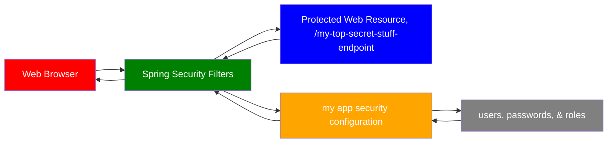
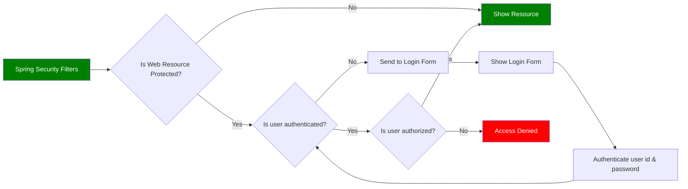

# REST API Security

- [Spring Security Tutorial](https://docs.spring.io/spring-security/reference/)

## Spring Security with Servlet Filters

- Servlet Filters are used to pre-process / post-process web requests
- Servlet Filters can route web requests based on security logic
- Spring provides a bulk of security functionality with servlet filters

## Spring Security Overview



## Spring Security in Action



## Security Concepts

- **Authentication**: check user id and password with credentials stored in app/db.
- **Authorization**: check to see if user has an authorized role.

### Declarative Security

- Define application’s security constraints in configuration
  - All Java config: `@Configuration`
- Provides separation of concerns between application code and security

### Programmatic Security

- Spring Security provides an API for custom application coding
- Provides greater customization for specific app requirements

## Enabling Spring Security

**pom.xml**

```
<dependency>
    <groupId>org.springframework.boot</groupId>
    <artifactId>spring-boot-starter-security</artifactId>
</dependency>
```

## Secured Endpoints

- Once you add the Spring Security dependency, all endpoints will automatically have a login prompt.

Login Prompt

- Default user name: `user`
- Check console logs in the terminal for password
  - `Using generated security password: RANDOMLY_GENERATED_PASSWORD`

## Spring Security Configuration

- You can override default user name and generated password

Example: **src/main/resources/application.properties**

```
spring.security.user.name=scott
spring.security.user.password=test123
```

## Configuring Basic Security

- Spring Security Password Storage
  - format: `{id}encodedPassword`
  - id can be:
    - noop: plain text passwords
    - bcrypt: BCrypt password hashing

**Development Process**:

1. Create Spring Security Configuration (`@Configuration`)

```js
import org.springframework.context.annotation.Configuration;

@Configuration
public class DemoSecurityConfig {
    // continue to step 2 to add our security configurations here ...
}
```

2. Add users, passwords and roles

**DemoSecurityConfig.java**

```js
import org.springframework.context.annotation.Bean;
import org.springframework.context.annotation.Configuration;
import org.springframework.security.provisioning.InMemoryUserDetailsManager;

@Configuration
public class DemoSecurityConfig {

    @Bean
    public InMemoryUserDetailsManager userDetailsManager() {
        UserDetails john = User.builder()
            .username("john")
            .password("{noop}test123")
            .roles("EMPLOYEE")
            .build();

        UserDetails mary = User.builder()
            .username("mary")
            .password("{noop}test123")
            .roles("EMPLOYEE", "MANAGER")
            .build();

        UserDetails susan = User.builder()
            .username("susan")
            .password("{noop}test123")
            .roles("EMPLOYEE", "MANAGER", "ADMIN")
            .build();

        return new InMemoryUserDetailsManager(john, mary, susan);
    }
}
```

:::warning
Once you test your endpoints in Postman, you might receive a 401 Unauthorized request.

Thus, Navigate to Authorization tab in Postman.

Under **Type**, hover to the select dropdown menu to select **Basic Auth**.

Enter **Username** and **Password**.

In the example above, use John credentials.

- Username: `john`
- Password: `test123`

Should see status 200 now!

:::

## Restrict Access Based on Roles

- General Syntax

```
// Restrict access to a given path “/api/employees”
// .hasRole means a single role
// authorized role is "ADMIN"

requestMatchers(<< add path to match on >>)
    .hasRole(<< authorized role >>)
```

- Specify HTTP method

```
requestMatchers(<< add HTTP METHOD to match on >>, << add path to match on >>)
    .hasRole(<< authorized roles >>)
```

- list of roles

```
// .hasAnyRole is any role
// list of authorized roles is a comma-delimited list

requestMatchers(<< add HTTP METHOD to match on >>, << add path to match on >>)
    .hasAnyRole(<< list of authorized roles >>)
```

- The \*\* syntax: match on all sub-paths

Example:

```js
requestMatchers(HttpMethod.GET, "/api/employees/**").hasRole("EMPLOYEE");
```

- Combined code example:

**DemoSecurityConfig.java**

```js
@Bean
public SecurityFilterChain filterChain(HttpSecurity http) throws Exception {

    http.authorizeHttpRequests(configurer ->
        configurer
            .requestMatchers(HttpMethod.GET, "/api/employees").hasRole("EMPLOYEE")
            .requestMatchers(HttpMethod.GET, "/api/employees/**").hasRole("EMPLOYEE")
            .requestMatchers(HttpMethod.POST, "/api/employees").hasRole("MANAGER")
            .requestMatchers(HttpMethod.PUT, "/api/employees/**").hasRole("MANAGER")
            .requestMatchers(HttpMethod.DELETE, "/api/employees/**").hasRole("ADMIN"));

    // use HTTP Basic authentication
    http.httpBasic(Customizer.withDefaults());

    // disable Cross Site Request Forgery (CSRF)
    // in general, not required for stateless REST APIs that use POST, PUT, DELETE, and/or PATCH
    http.csrf(csrf -> csrf.disable());

    return http.build();
}

```

:::note
Test with the credentials generated in the previous section in Postman. Some employees should have access to POST, PUT, DELETE. Some do not. Play around to see what happens when unauthorized users try to do a certain action. This demonstrates authorization access permissions for certain tasks for authenticated users.
:::

## Cross-Site Request Forgery (CSRF)

- Spring Security can protect against CSRF attacks
- Embed additional authentication data/token into all HTML forms
- On subsequent requests, web app will verify token before processing
- Primary use case is traditional web applications (HTML forms etc)

## When to use CSRF Protection?

- Use CSRF protection for any normal browser web requests
- Traditional web apps with HTML forms to add/modify data
- If you are building a REST API for non-browser clients, you may want to disable CSRF protection
- In general, not required for stateless REST APIs that use POST, PUT, DELETE and/or PATCH

```js
// disable Cross Site Request Forgery (CSRF)
http.csrf(csrf -> csrf.disable());
```

## Spring Security User Accounts Stored in Database

- Spring Security can read user account info from database
- By default, you have to follow Spring Security’s predefined table schemas

### Customize Database Access with Spring Security

- Can also customize the table schemas
- Useful if you have custom tables specific to your project / custom
- You will be responsible for developing the code to access the data

**Development Process**:

1. Develop SQL Script to set up database tables

```
CREATE TABLE `users` (
    `username` varchar(50) NOT NULL,
    `password` varchar(50) NOT NULL,
    `enabled` tinyint NOT NULL,
    PRIMARY KEY (`username`)
) ENGINE=InnoDB DEFAULT CHARSET=latin1;
```

- `noop` is an encoding algorithm id and allows Spring Security to know the passwords are stored as plain text
- `test123` is the password

```
INSERT INTO `users`
VALUES
('john','{noop}test123',1),
('mary','{noop}test123',1),
('susan','{noop}test123',1);

```

```
CREATE TABLE `authorities` (
    `username` varchar(50) NOT NULL,
    `authority` varchar(50) NOT NULL,

    UNIQUE KEY `authorities_idx_1` (`username`,`authority`),

    CONSTRAINT `authorities_ibfk_1`
    FOREIGN KEY (`username`)
    REFERENCES `users` (`username`)
) ENGINE=InnoDB DEFAULT CHARSET=latin1;
```

- "authorities" same as "roles"
- Internally Spring Security uses “ROLE\_” prefix

```
INSERT INTO `authorities`
VALUES
('john','ROLE_EMPLOYEE'),
('mary','ROLE_EMPLOYEE'),
('mary','ROLE_MANAGER'),
('susan','ROLE_EMPLOYEE'),
('susan','ROLE_MANAGER'),
('susan','ROLE_ADMIN');

```

2. Add database support to Maven POM file

```
<!-- MySQL -->
<dependency>
    <groupId>com.mysql</groupId>
    <artifactId>mysql-connector-j</artifactId>
    <scope>runtime</scope>
</dependency>
```

3. Create JDBC properties file

**application.properties**

```
#
# JDBC connection properties
#
spring.datasource.url=jdbc:mysql://localhost:3306/employee_directory
spring.datasource.username=springstudent
spring.datasource.password=springstudent
```

4. Update Spring Security Configuration to use JDBC

```js
// don't use hard coded user implementation above anymore

@Configuration
public class DemoSecurityConfig {
    //Inject data source. Auto-configured by Spring Boot
    @Bean
    public UserDetailsManager userDetailsManager(DataSource dataSource) {

        //Tell Spring Security to use JDBC authentication with our data source
        return new JdbcUserDetailsManager(dataSource);
    }

...
}
```

## Spring Security Password Encryption

- The best practice is store passwords in an encrypted format

`{bcrypt}encrypted_password_here`

- Spring Security recommends using the popular bcrypt algorithm
- bcrypt
  - Performs **one-way encrypted hashing**
  - Adds a random salt to the password for additional protection
  - Includes support to defeat brute force attacks

### How to Get a Bcrypt password

- You have a plaintext password and you want to encrypt using bcrypt

1. Use a website utility to perform the encryption
   - [generate-bcrypt-password](https://www.bcryptcalculator.com/)
2. Write Java code to perform the encryption

### Modify DDL for Password Field

```
CREATE TABLE `users` (
    `username` varchar(50) NOT NULL,
    `password` char(68) NOT NULL,
    `enabled` tinyint NOT NULL,

    PRIMARY KEY (`username`)
) ENGINE=InnoDB DEFAULT CHARSET=latin1;
```

### Development Process

- Run SQL Script that contains encrypted passwords
  - Modify DDL for password field, length should be 68
  - `{bcrypt}` - 8 chars
  - encodedPassword - 60 chars
- No need to change Java source code

- `bcrypt` is the encoding algorithm id
- The encrypted password is actually fun123

```
INSERT INTO `users`
VALUES
(‘john','{bcrypt}$2a$10$qeS0HEh7urweMojsnwNAR.vcXJeXR1UcMRZ2WcGQl9YeuspUdgF.q',1),
('mary','{bcrypt}$2a$04$eFytJDGtjbThXa80FyOOBuFdK2IwjyWefYkMpiBEFlpBwDH.5PM0K',1),
('susan','{bcrypt}$2a$04$eFytJDGtjbThXa80FyOOBuFdK2IwjyWefYkMpiBEFlpBwDH.5PM0K',1);
```

## For Security Schema Customization Example

- Tell Spring how to query your custom tables
- Provide query to find user by user name
- Provide query to find authorities / roles by user name

### Development Process

1. Create our custom tables with SQL

```
members class

user_id VARCHAR(50)
pw CHAR(68)
active TINYINT(1)
```

```
roles class

user_id VARCHAR(50)
role VARCHAR(50)

```

2. Update Spring Security Configuration

- Provide query to find user by user name
- Provide query to find authorities / roles by user name

```js
@Configuration
public class DemoSecurityConfig {
    @Bean
    public UserDetailsManager userDetailsManager(DataSource dataSource) {
        JdbcUserDetailsManager theUserDetailsManager = new JdbcUserDetailsManager(dataSource);

        // Question mark “?” Parameter value will be the user name from login
        // How to find users
        theUserDetailsManager
        .setUsersByUsernameQuery("select user_id, pw, active from members where user_id=?");

        // Question mark “?” Parameter value will be the user name from login
        // How to find roles
        theUserDetailsManager
        .setAuthoritiesByUsernameQuery("select user_id, role from roles where user_id=?");

        return theUserDetailsManager;
    }
    ...
}
```

### Debugging security

**application.properties**

```
logging.level.org.springframework.security=DEBUG
```
