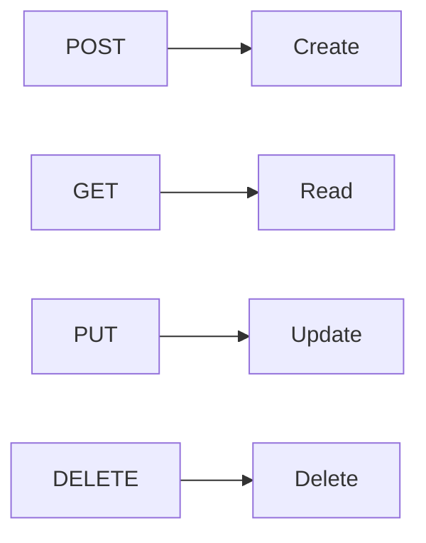
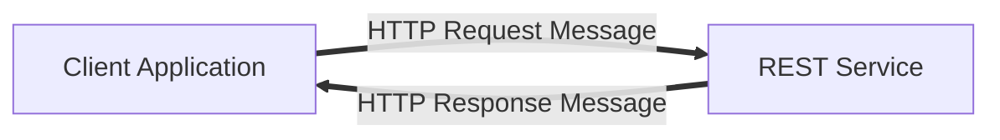
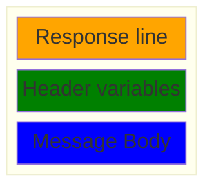
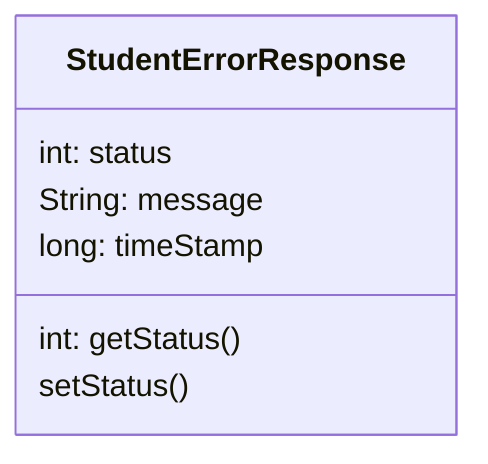
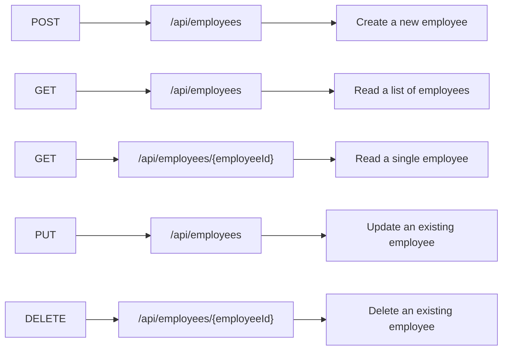
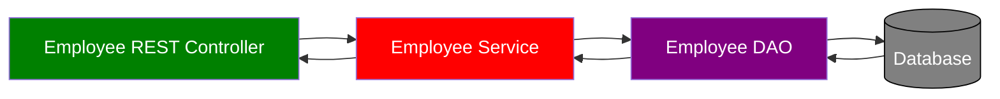

# REST CRUD APIs

## REST API

- **REST**: REpresentational State Transfer
- Lightweight approach for communicating between applications
  - REST API calls over HTTP
  - Any programming language
- Data format:
  - XML
  - JSON (JavaScript Object Notation)

## JSON Example

```
{
    "id": 14,
    "firstName": "Mario",
    "lastName": "Rossi",
    "active": true
}
```

## REST over HTTP

- Use HTTP methods for CRUD operations



## HTTP Messages



### HTTP Request Message

- Request line: the HTTP command
- Header variables: request metadata
- Message body: contents of message

**HTTP Request message**


### HTTP Response Message

- Response line: server protocol and status code
- Header variables: response metadata
- Message body: contents of message

**HTTP Response Message**



### HTTP Response - Status Codes

- Informational: 100 - 199
- Successful: 200 - 299
- Redirection: 300 - 399
- Client Error: 400 - 499
- Server Error: 500 - 599

### MIME Content Types

- Multipurpose Internet Mail-Extension
- Basic Syntax: type/sub-type
- Examples
  - text/html, text/plain
  - application/json, application/xml,

### Postman

- Postman is a good client tool to Send HTTP requests to the REST Web Service / API

## Spring REST Controller

```js
// @RestController annotation adds REST Support
@RestController
@RequestMapping("/test")
public class DemoRestController {

    //Access the REST endpoint at /test/hello
    @GetMapping("/hello")
    public String sayHello() {
        //return this content to the client
        return "Hello World!";
    }
}
```

:::note
When we send a GET request to http://localhost:8080/spring-rest-demo/test/hello, we will see the response: Hello World!
:::

## Spring REST Controller - Dev Process

1. Add Maven dependency for Spring Boot Starter Web

In the **pom.xml** file,

```
<!-- Add Spring Boot Starter Web -->
<dependency>
    <groupId>org.springframework.boot</groupId>
    <artifactId>spring-boot-starter-web</artifactId>
</dependency>
```

2. Create Spring REST Service using @RestController

Example:

```js
@RestController
@RequestMapping("/test")
public class DemoRestController {

    //Recall that this Handles HTTP GET requests
    @GetMapping("/hello")
    public String sayHello() {
        return "Hello World!";
    }
}
```

## Java JSON Data Binding

- Data binding is the process of converting JSON data to a Java POJO
- AKA:
  - Mapping
  - Serialization / Deserialization
  - Marshalling / Unmarshalling


## Spring REST Service - Students example

What does creating a new service mean?

Example:

- Objective: Return a list of students
- Use a **GET** Request at this endpoint: `/api/students`

JSON converted to Java POJO and vice versa is automatically handled by Spring Boot.

**Development Process**:

1. Create Java POJO class for Student

```js
public class Student {
  private String firstName;
  private String lastName;

  public Student() {

  }

  public Student(String firstName, String lastName) {
    this.firstName = firstName;
    this.lastName = lastName;
  }

  public String getFirstName() {
    return firstName;
  }

  public void setFirstName(String firstName) {
    this.firstName = firstName;
  }

  public String getLastName() {
    return lastName;
  }

  public void setLastName(String lastName) {
    this.lastName = lastName;
  }
}
```

2. Create Spring REST Service using @RestController

```js
@RestController
@RequestMapping("/api")
public class StudentRestController {
  // define endpoint for "/students" - return list of students
  @GetMapping("/students")
  public List<Student> getStudents() {
    List<Student> theStudents = new ArrayList<>();

    theStudents.add(new Student("Poornima", "Patel"));
    theStudents.add(new Student("Mario", "Rossi"));
    theStudents.add(new Student("Mary", "Smith"));

    return theStudents;
  }
}
```

### Path Variables & @PathVariable

Retrieve a single student by id

**GET** `/api/students/{studentId} `

studentId is a path variable.

**Development Process**:

- Add request mapping to Spring REST Service
  - Bind path variable to method parameter using @PathVariable

```js
@RestController
@RequestMapping("/api")
public class StudentRestController {
  // define endpoint for "/students/{studentId}" - return student at index
  // Require the @PathVariable annotation
  @GetMapping("/students/{studentId}")
  public Student getStudent(@PathVariable int studentId) {
    List<Student> theStudents = new ArrayList<>();
    // populate theStudents
    …
    return theStudents.get(studentId);
  }
}
```

## Spring REST - Exception Handling

If there is bad data, throw an exceptions.

e.g. 9999 is a bad path variable

We receive `/api/students/9999`

We throw back:

```
{
  "status": 404,
  "message": "Student Id not found - 9999",
  "timeStamp": 433254242
}
```

- Exception handler code is only for the specific REST controller
- Can't be reused by other controllers

### @ExceptionHandler

- Exception handler will return a ResponseEntity
- **ResponseEntity** is a wrapper for the HTTP response object
- ResponseEntity provides fine-grained control to specify:
  - HTTP status code
  - HTTP headers
  - Response body

**Development Process**:

1. Create a custom error response class

- Developer defines the error response as a POJO



```ts
public class StudentErrorResponse {
  private int status;
  private String message;
  private long timeStamp;
  // constructors
  // getters / setters
}
```

- The custom error response class will be sent back to client as JSON

```
{
  "status": 404,
  "message": "Student Id not found - 9999",
  "timeStamp": 433254242
}
```

2. Create a custom exception class

```ts
public class StudentNotFoundException extends RuntimeException {
  public StudentNotFoundException(String message) {
    super(message);
  }
}
```

3. Update REST service to throw exception if student not found

```ts
@RestController
@RequestMapping("/api")
public class StudentRestController {
  @GetMapping("/students/{studentId}")
  public Student getStudent(@PathVariable int studentId) {
    // check the studentId against list size
    if ( (studentId >= theStudents.size()) || (studentId < 0) ) {
      throw new StudentNotFoundException("Student id not found - " + studentId);
    }

    return theStudents.get(studentId);
  }
  ...
}
```

4. Add an exception handler method using @ExceptionHandler

```ts
@RestController
@RequestMapping("/api")
public class StudentRestController {
  ...
  /*
   * Params: StudentNotFoundException is an Exception type to handle / catch
   * Returns: ResponseEntity<StudentErrorResponse> where StudentErrorResponse is the type of the response body
   *
  */
  @ExceptionHandler
  public ResponseEntity<StudentErrorResponse> handleException(StudentNotFoundException exc) {
    StudentErrorResponse error = new StudentErrorResponse();
    error.setStatus(HttpStatus.NOT_FOUND.value());
    error.setMessage(exc.getMessage());
    error.setTimeStamp(System.currentTimeMillis());

    // error is Body
    // HttpStatus.NOT_FOUND is a Status code
    return new ResponseEntity<>(error, HttpStatus.NOT_FOUND);
  }
}
```

## Spring REST - Global Exception Handling

- Global exception handlers
  - promotes reuse of exception handlers
  - centralizes exception handling

### @ControllerAdvice

- @ControllerAdvice is similar to an interceptor / filter
- Pre-process requests to controllers
- Post-process responses to handle exceptions
- Perfect for global exception handling

**Development Process**:

1. Create new @ControllerAdvice

```js
@ControllerAdvice
public class StudentRestExceptionHandler {
  ...
}
```

2. Refactor REST service ... remove exception handling code
3. Add exception handling code to @ControllerAdvice

**StudentRestExceptionHandler.java**

```ts
@ControllerAdvice
public class StudentRestExceptionHandler {
  @ExceptionHandler
  public ResponseEntity<StudentErrorResponse> handleException(StudentNotFoundException exc) {
    StudentErrorResponse error = new StudentErrorResponse();
    error.setStatus(HttpStatus.NOT_FOUND.value());
    error.setMessage(exc.getMessage());
    error.setTimeStamp(System.currentTimeMillis());
    return new ResponseEntity<>(error, HttpStatus.NOT_FOUND);
  }
}
```

## Spring REST API Design

**API Design Process**:

1. Review API requirements

- **Example**: Create a REST API for the Employee Directory

  REST clients should be able to

  - Get a list of employees
  - Get a single employee by id
  - Add a new employee
  - Update an employee
  - Delete an employee

2. Identify main resource / entity

- To identify main resource / entity, look for the most prominent "noun"
- For our project, it is "employee"
- Convention is to use plural form of resource / entity: employees
  ```
  /api/employees
  ```

3. Use HTTP methods to assign action on resource



### Bad REST API Design | Anti-Patterns

Don't include actions in the endpoint:

:::danger
These are REST anti-patterns, bad practice

```
/api/employeesList
/api/deleteEmployee
/api/addEmployee
/api/updateEmployee
```

:::

- Instead, use HTTP methods to assign actions

## Spring Boot REST API - Real Time Project

- REST API with Spring Boot that connects to a database
  **Application Architecture**:



### Purpose of Service Layer

- Service Facade design pattern
- Intermediate layer for custom business logic
- Integrate data from multiple sources (DAO/repositories)

### @Service

- **@Service** applied to Service implementations

```mermaid
flowchart TD

A[@RestController] --> D[@Component]
B[@Respository] --> D
C[@Service] --> D

style A fill:blue,color:white;
style B fill:orange,color:white;
style C fill:red,color:white;
style D fill:green,color:white;
```

### Service Layer - Best Practice

- Best practice is to apply transactional boundaries at the service layer
- It is the service layer’s responsibility to manage transaction boundaries
- For implementation code
  - Apply @Transactional on service methods
  - Remove @Transactional on DAO methods if they already exist

### Sending JSON to Spring REST Controllers

- For controller to process JSON data, need to set a HTTP request header
  - `Content-type: application/json`
- Need to configure REST client to send the correct HTTP request header

### Development Process

1. Set up Database Dev Environment
   Example: **File: employee.sql**

- Create a new database table: employee
- Load table with sample data

2. Create Spring Boot project using Spring Initializr

3. Get list of employees

**Step 1: DAO Interface**:

```js
public interface EmployeeDAO {
  List<Employee> findAll();
}
```

**Step 2: DAO Impl**:

```ts
@Service
public class EmployeeServiceImpl implements EmployeeService {
  // inject EmployeeDAO …
  @Override
  public List<Employee> findAll() {
    return employeeDAO.findAll();
  }
}
```

**DAO: Get a list of employees**:

```ts
@Override
public List<Employee> findAll() {
  // create a query
  TypedQuery<Employee> theQuery = entityManager.createQuery("from Employee", Employee.class);
  // execute query and get result list
  List<Employee> employees = theQuery.getResultList();
  // return the results
  return employees;
}
```

4. Get single employee by ID

**DAO: Get a single employee**

```ts
@Override
public Employee findById(int theId) {
  // get employee
  Employee theEmployee = entityManager.find(Employee.class, theId);
  // return employee
  return theEmployee;
}
```

5. Add a new employee
6. Update an existing employee

**DAO: Add or Update employee**:

:::note
We don’t use @Transactional at DAO layer.
It will be handled at Service layer.
:::

```ts

@Override
public Employee save(Employee theEmployee) {
  // if id == 0 then save/insert
  // else update
  Employee dbEmployee = entityManager.merge(theEmployee);
  // return dbEmployee
  // It has updated id from the database (in the case of insert)
  return dbEmployee;
}
```

7. Delete an existing employee

**DAO: Delete an existing employee**:

:::note
We don’t use @Transactional at DAO layer.
It will be handled at Service layer.
:::

```js
@Override
public void deleteById(int theId) {
  // find the employee by id
  Employee theEmployee = entityManager.find(Employee.class, theId);
  // delete the employee
  entityManager.remove(theEmployee);
}
```

:::note
Refer to code in VS code for examples.
:::

## Spring Data JPA

- https://spring.io/projects/spring-data-jpa
- Create a DAO and just plug in your **entity type** and **primary key**
  - Spring will give you a CRUD implementation for FREEs
  - More than 70% reduction in code ... depending on use case

### JpaRepository

- https://docs.spring.io/spring-data/jpa/docs/current/api/org/springframework/data/jpa/repository/JpaRepository.html
- Spring Data JPA provides the interface: `JpaRepository`
  - Exposes methods (some by inheritance from parents)

**Development Process**

1. Extend JpaRepository interface

```js
// Employee is the Entity type
// Integer is the Primary Key
public interface EmployeeRepository extends JpaRepository<Employee, Integer> {
  // that's it ... no need to write any code LOL!
}
```

2. Use your Repository in your app

```js
@Service
public class EmployeeServiceImpl implements EmployeeService {
  private EmployeeRepository employeeRepository;

  @Autowired
  public EmployeeServiceImpl(EmployeeRepository theEmployeeRepository) {
    employeeRepository = theEmployeeRepository;
  }

  @Override
  public List<Employee> findAll() {
    //findAll() method available from JpaRepository implementation
    return employeeRepository.findAll();
  }

}
```

## Spring Data REST

- https://spring.io/projects/spring-data-rest
- Leverages your existing `JpaRepository`
- Give you a REST CRUD implementation for FREE

**Development Process**:

- Add Spring Data REST to your Maven POM file
- No additional coding required

```
<dependency>
  <groupId>org.springframework.boot</groupId>
  <artifactId>spring-boot-starter-data-rest</artifactId>
</dependency>
```

Thus, all you need to do is:

1. Your entity: `Employee`
2. JpaRepository: `EmployeeRepository extends JpaRepository`
3. Maven POM dependency for: `spring-boot-starter-data-rest`

### REST Endpoints

- By default, Spring Data REST will create endpoints based on entity type
  - In Simple pluralized form
    - First character of Entity type is lowercase
    - Then just adds an "s" to the entity

Example:

```js
// Employee --> "/employees"
public interface EmployeeRepository extends JpaRepository<Employee, Integer> {
}
```

:::warning
Sometimes we need to customize the endpoint name or the plural noun is not simply putting an "s" at the end of it i.e. geese is plural for goose

- Thus, specify plural name / path with an annotation

```js
//endpoints will be http://localhost:8080/members
@RepositoryRestResource(path="members")
public interface EmployeeRepository extends JpaRepository<Employee, Integer> {
}
```

:::

### HATEOAS

Hypermedia as the Engine of Application State

- Hypermedia-driven sites provide information to access REST interfaces
  - Think of it as meta-data for REST data

### Pagination

- By default, Spring Data REST will return the first 20 elements
  - Page size = 20
  - Pages are zero-based

Example:

```
http://localhost:8080/employees?page=0
http://localhost:8080/employees?page=1
...
```

- Configuration in **application.properties**
  - `spring.data.rest.base-path`: Base path used to expose repository resources
  - `spring.data.rest.default-page-size`: Default size of pages
  - `spring.data.rest.max-page-size`: Maximum size of pages

e.g. **application.properties**

```
spring.data.rest.base-path=/magic-api
spring.data.rest.default-page-size=50
```

Outcome:

- `http://localhost:8080/magic-api/employees`
- Returns 50 elements per page
