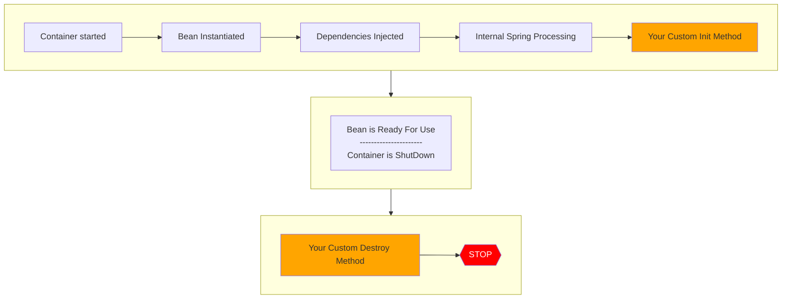

# Spring Core

## Inversion of Control

**Inversion of Control**: The approach of outsourcing the construction and management of objects.

### Spring Container

- Primary functions:
  - Create and manage objects (Inversion of Control)
  - Inject object dependencies (Dependency Injection)

## Dependency Injection

**Dependency Injection**:

- The dependency inversion principle.
- The client delegates to another object the responsibility of providing its dependencies.
- Example: A Controller wants to use a class Coach.
  - Coach is a _dependency_ that needs to be injected into the Controller.
- Dependency Injection uses **autowiring**, which is when Spring injects a dependency automatically.
  - Spring will search for a class that matches by type:
    - Class
    - Interface
  - Example of **autowiring**:
    - Inject a Coach implementation.
    - Suppose there is a Coach interface.
    - Spring will scan for `@Components`.
    - CricketCoach implements the Coach interface.
    - CricketCoach will be injected.

### Two Types of Injection

- **Constructor Injection**
  - Use this when you have required dependencies
- **Setter Injection**
  - Use this when you have optional dependencies

### Constructor Injection

1. Define the dependency interface and class

```js
public interface Coach {
    String getDailyWorkout();
}
```

```js
import org.springframework.stereotype.Component;

//@Component annotation marks the class as a Spring Bean
//@Component makes the bean available for dependency injection
//This means @Component will allow the bean to be injected into the contructor of the RestController
@Component
public class CricketCoach implements Coach {
    @Override
    public String getDailyWorkout() {
        return "Practice fast bowling for 15 minutes";
    }
}
```

2. Create Demo REST Controller
3. Create a constructor in your class for injections
4. Add @GetMapping for /dailyworkout

Steps 2-4 showcase here:

```js
import org.springframework.beans.factory.annotation.Autowired;
import org.springframework.web.bind.annotation.GetMapping;
import org.springframework.web.bind.annotation.RestController;

@RestController
public class DemoController {
    private Coach myCoach;

    // @Autowired annotation tells Spring to inject a dependency
    @Autowired
    public DemoController(Coach theCoach) {
        myCoach = theCoach;
    }

    @GetMapping("/dailyworkout")
    public String getDailyWorkout() {
        return myCoach.getDailyWorkout();
    }
}
```

### Setter Injection

1. Create setter method(s) in your class for injections
2. Configure the dependency injection with @Autowired Annotation

```js
@RestController
public class DemoController {
    private Coach myCoach;

    @Autowired
    public void setCoach(Coach theCoach) {
        myCoach = theCoach;
    }
}
```

## @Qualifier

- One solution when there are multiple implementations of a class.
- `@Qualifier` helps specify which bean to use.

:::note
Contructor Injection with Qualifier example below: assume there is CricketCoach, BasketballCoach, FootballCoach, etc. And we want to specify we want CricketCoach
:::

```js
import com.luv2code.springcoredemo.common.Coach;
import org.springframework.beans.factory.annotation.Autowired;
import org.springframework.beans.factory.annotation.Qualifier;

@RestController
public class DemoController {
    private Coach myCoach;

    //In the @Qualifier annotation, specify the bean id: cricketCoach
    //The bean id is the same name as the class, first character is lower-case.
    @Autowired
    public DemoController(@Qualifier("cricketCoach") Coach theCoach) {
        myCoach = theCoach;
    }

    @GetMapping("/dailyworkout")
    public String getDailyWorkout() {
        return myCoach.getDailyWorkout();
    }
}
```

## @Primary

- This is another option when given multiple implementations to use, but the developer does not care which implementation (child class) is used. Any will do.
- Thus, use the `@Primary` annotation.
- Do not need `@Qualifier` along with `@Primary` for the same bean id.
- When using `@Primary`, can have only one for multiple implementations.
  - If you mark multiple classes with `@Primary`, then there is an error.
- However, if you require the use of both `@Primary` and `@Qualifier`, then `@Qualifier` has higher precedence.

```js
import org.springframework.context.annotation.Primary;
import org.springframework.stereotype.Component;

@Component
@Primary
public class TrackCoach implements Coach {
    @Override
    public String getDailyWorkout() {
        return "Run a hard 5k!";
    }
}
```

Notice that the RestController will use TrackCoach since it is Primary.

```js
import com.luv2code.springcoredemo.common.Coach;
import org.springframework.beans.factory.annotation.Autowired;

@RestController
public class DemoController {
    private Coach myCoach;

    //Notice no need for @Qualifier if above TrackCoach is Primary.
    //This example will use TrackCoach since TrackCoach is Primary
    @Autowired
    public DemoController(Coach theCoach) {
        myCoach = theCoach;
    }

    @GetMapping("/dailyworkout")
    public String getDailyWorkout() {
        return myCoach.getDailyWorkout();
    }
}
```

However, if the RestController has a Qualifier with a bean id that is not TrackCoach, then the Qualifier has higher precedence.

```js
import com.luv2code.springcoredemo.common.Coach;
import org.springframework.beans.factory.annotation.Autowired;

@RestController
public class DemoController {
    private Coach myCoach;

    //This example will use CricketCoach regardless if TrackCoach is Primary.
    //This is because a @Qualifier CricketCoach has higher priority than @Primary
    @Autowired
    public DemoController(@Qualifier("cricketCoach") Coach theCoach) {
        myCoach = theCoach;
    }

    @GetMapping("/dailyworkout")
    public String getDailyWorkout() {
        return myCoach.getDailyWorkout();
    }
}
```

:::tip
Thus, just use `@Qualifier` when multiple implementations are involved.
:::

## Lazy Initialization

- Instead of creating all beans up front, we can specify lazy initialization
  - A bean will only be initialized in the following cases:
    1. It is needed for dependency injection
    2. Or it is explicitly requested
- Advantages
  - Only create objects as needed
  - May help with faster startup time if you have large number of components
- Disadvantages
  - If you have web related components like `@RestController`, not created until requested
  - May not discover configuration issues until too late
  - Need to make sure you have enough memory for all beans once created

### @Lazy

```js
import org.springframework.context.annotation.Lazy;
import org.springframework.stereotype.Component;

//@Lazy annotation: Bean is only initialized if needed for dependency injection
@Component
@Lazy
public class TrackCoach implements Coach {
    public TrackCoach() {
        System.out.println("In constructor: " + getClass().getSimpleName());
    }
}
```

Let's say we don't inject TrackCoach, we inject CricketCoach in the RestController.

```js
@RestController
public class DemoController {
    private Coach myCoach;

    @Autowired
    public DemoController(@Qualifier("cricketCoach") Coach theCoach) {
        myCoach = theCoach;
    }
}
```

Since we are NOT injecting TrackCoach, then it is not initialized.
Thus, in the terminal, we see:

```
In constructor: BaseballCoach
In constructor: CricketCoach
In constructor: TennisCoach
```

:::warning
Adding `@Lazy` to each class is a lot of unnessary work, especially when there are tons of classes to work with.
:::

:::tip
Lazy Initialization - Global configuration.
Within the **application.properties** file,

```
spring.main.lazy-initialization=true
```

This makes all beans lazy, which means no beans are created until needed, including the RestController.
:::

:::danger
Lazy initialization feature is disabled by default.
You should profile your application before configuring lazy initialization.
Avoid the common pitfall of premature optimization.
:::

## Bean Scopes

- Scope refers to the lifecycle of a bean
  - How long does the bean live?
  - How many instances are created?
  - How is the bean shared?

### Default Scope

- Default scope is **singleton**.
  - Spring Container creates only one instance of the bean, by default
  - It is cached in memory
  - All dependency injections for the bean will reference the SAME bean

```js
@RestController
public class DemoController {
    private Coach myCoach;
    private Coach anotherCoach;

    //Both theCoach and anotherCoach point to the same instance of CricketCoach
    @Autowired
    public DemoController(@Qualifier("cricketCoach") Coach theCoach, @Qualifier("cricketCoach") Coach theAnotherCoach) {
        myCoach = theCoach;
        anotherCoach = theAnotherCoach;
    }
}
```

### Explicitly Specify Bean Scope

```js
import org.springframework.context.annotation.Scope;

//Specify this is a bean scope of singleton.
@Scope(ConfigurableBeanFactory.SCOPE_SINGLETON)
public class CricketCoach implements Coach {
    ...
}
```

#### Common List of Spring Bean Scopes

- **singleton**: Create a single shared instance of the bean. Default scope.
- **prototype**: Creates a new bean instance for each container request.
- **request**: Scoped to an HTTP web request. Only used for web apps.
- **session**: Scoped to an HTTP web session. Only used for web apps.
- **application**: Scoped to a web app ServletContext. Only used for web apps.
- **websocket**: Scoped to a web socket. Only used for web apps.

## Bean Lifecycle



### Bean Lifecycle Methods

- You can add custom code during **bean initialization**
  - Calling custom business logic methods
  - Setting up handles to resources (db, sockets, file etc)
- You can add custom code during **bean destruction**
  - Calling custom business logic method
  - Clean up handles to resources (db, sockets, files etc)

```js
@Component
public class CricketCoach implements Coach {
    public CricketCoach() {
        System.out.println("In constructor: " + getClass().getSimpleName());
    }

    //Init: method configuration
    @PostConstruct
    public void doMyStartupStuff() {
        System.out.println("In doMyStartupStuff(): " + getClass().getSimpleName());
    }

    //Destroy: method configuration
    @PreDestroy
    public void doMyCleanupStuff() {
        System.out.println("In doMyCleanupStuff(): " + getClass().getSimpleName());
    }
}
```

## @Configuration

1. Create @Configuration class

```js
import org.springframework.context.annotation.Configuration;

@Configuration
public class SportConfig {
    …
}
```

2. Define @Bean method to configure the bean

```js
import com.luv2code.springcoredemo.common.Coach;
import com.luv2code.springcoredemo.common.SwimCoach;
import org.springframework.context.annotation.Bean;
import org.springframework.context.annotation.Configuration;
@Configuration
    public class SportConfig {

        // The bean id defaults to the method name
        @Bean
        public Coach swimCoach() {
            return new SwimCoach();
        }
}
```

3. Inject the bean into our controller

```js
import com.luv2code.springcoredemo.common.Coach;
import org.springframework.beans.factory.annotation.Autowired;
import org.springframework.beans.factory.annotation.Qualifier;
import org.springframework.web.bind.annotation.GetMapping;
import org.springframework.web.bind.annotation.RestController;

@RestController
public class DemoController {
    private Coach myCoach;

    //Inject SwimCoach using the bean id
    @Autowired
    public DemoController(@Qualifier("swimCoach") Coach theCoach) {
        System.out.println("In constructor: " + getClass().getSimpleName());
        myCoach = theCoach;
    }
}
```

:::note
Use case for `@Bean`:

- You may not have access to the source code of a third-party class
- Thus, you would like to use the third-party class as a Spring bean
  :::

- Example:
  - We could use the Amazon S3 Client in our Spring application
  - The Amazon S3 Client class was not originally annotated with `@Component`
  - However, we configured the S3 Client as a Spring Bean using `@Bean`
  - It is now a Spring Bean and we can inject it into other services of our application
