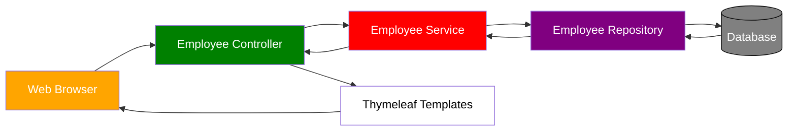

# Spring MVC CRUD

- Example: Create a Web UI for the Employee Directory
- Use Thymeleaf + Spring Boot
- Users should be able to
  - Get a list of employees
  - Add a new employee
  - Update an employee
  - Delete an employee



## Project Setup

- We will extend our existing Employee project and add DB integration
- Add EmployeeService, EmployeeRepository and Employee entity
  - Available in one of our previous projects
  - We created all of this code already from scratch ... so we'll just copy/paste it
- Allows us to focus on creating EmployeeController and Thymeleaf templates

### Development Process

1. Get list of employees
2. Add a new employee
3. Update an existing employee
4. Delete an existing employee

## Thymeleaf - Get Employee

1. Create a Spring MVC Controller

**EmployeeController.java**

```js
 @Controller
 @RequestMapping("/employees") //base mapping for url requests
 public class EmployeeController {
    private EmployeeService employeeService;

     // this uses constructor injection
    public EmployeeController(EmployeeService theEmployeeService){
      employeeService = theEmployeeService;
    }

    // add mapping for "/list"
    @GetMapping("/list")
    public String listEmployees(Model theModel){
      // get the employee from db
      List<Employee> theEmployees = employeeService.findAll();

      // add to the spring model
      theModel.addAttribute("employees", theEmployees);

      return "employees/list-employees";
    }
}
```

2. Create html file in thymeleaf

**list.employees.html**

```html
<!-- This will use bootstrap styles -->

<div class="container">
  <h3>Employee Directory</h3>

  <hr />

  <table class="table table-bordered table-striped">
    <thead class="table-dark">
      <tr>
        <th>First Name</th>
        <th>Last Name</th>
        <th>Email</th>
      </tr>
    </thead>

    <tbody>
      <tr th:each="tempEmployee : ${employees}">
        <td th:text="${tempEmployee.firstName}"></td>
        <td th:text="${tempEmployee.lastName}"></td>
        <td th:text="${tempEmployee.email}"></td>
      </tr>
    </tbody>
  </table>
</div>
```

3. Add **index.html** to redirect to "employees/list"

- `URL='employees/list'` is a html trick that will auto redirect to another url

```html
<meta http-equiv="refresh" content="0; URL='employees/list'" />
```

## Thymeleaf - Add Employee

1. New Add Employee button for list-employees.html

- Add Employee button will href link to
  - request mapping `/employees/showFormForAdd`

```html
<!-- @ symbol Reference context path of your application (app root) -->
<a th:href="@{/employees/showFormForAdd}" class="btn btn-primary btn-sm mb-3">
  Add Employee
</a>
```

**Controller**

```js
 @Controller
 @RequestMapping("/employees") //base mapping for url requests
 public class EmployeeController {
    ...

   @GetMapping("/showFormForAdd")
   public String showFormForAdd(Model theModel) {

     // create model attribute to bind form data
     Employee theEmployee = new Employee();
     theModel.addAttribute("employee", theEmployee);

    // Our Thymleaf template will access this data for binding form data
    // src/main/resources/templates/employees/employee-form.html
     return "employees/employee-form";
   }
}
```

- Thymeleaf has special expressions for binding Spring MVC form data
- Automatically setting / retrieving data from a Java object

- Thymeleaf Expressions
  - `th:action`: Location to send form data
  - `th:object`: Reference to model attribute
  - `th:field`: Bind input field to a property on model attribute
  - [thymeleaf-expressions](https://www.thymeleaf.org/doc/tutorials/3.0/thymeleafspring.html#creating-a-form)

2. Create HTML form for new employee

```html
<!-- # is an Empty place holder. Thymeleaf will handle real work -->
<!-- Real work. Send form data to /employees/save -->
<form
  action="#"
  th:action="@{/employees/save}"
  th:object="${employee}"
  method="POST"
>
  <!-- *{...} Selects property on referenced th:object -->
  <input
    type="text"
    th:field="*{firstName}"
    placeholder="First name"
    class="form-control mb-4 w-25"
  />

  <input
    type="text"
    th:field="*{lastName}"
    placeholder="Last name"
    class="form-control mb-4 w-25"
  />

  <input
    type="text"
    th:field="*{email}"
    placeholder="Email"
    class="form-control mb-4 w-25"
  />

  <button type="submit" class="btn btn-info col-2">Save</button>
</form>

<hr />

<!-- Back to Employees List Button -->
<a th:href="@{/employees/list}">Back to Employees List</a>
```

- this html corresponds to the model attribute in the controller:

```js
theModel.addAttribute("employee", theEmployee);
```

3. Process form data to save employee

```js
@Controller
@RequestMapping("/employees")
public class EmployeeController {
    ...

    // this ModelAttribute connects with thymeleaf
    @PostMapping("/save")
    public String saveEmployee(@ModelAttribute("employee") Employee theEmployee) {
        // save the employee
        employeeService.save(theEmployee);
        // use a redirect to prevent duplicate submissions
        return "redirect:/employees/list";
    }
}
```

## Thymeleaf - Update Employee

1. "Update" button

- Update button includes employee id

```html
<tr th:each="tempEmployee : ${employees}">
  ...
  <td>
    <!-- employeeId  is appended to the url -->
    <a
      th:href="@{/employees/showFormForUpdate(employeeId=${tempEmployee.id})}"
      class="btn btn-info btn-sm"
    >
      Update
    </a>
  </td>
</tr>
```

2. Pre-populate the form

```js
@Controller
@RequestMapping("/employees")
public class EmployeeController {
...

    //employeeId RequestParam corresponds to html above
  @GetMapping("/showFormForUpdate")
  public String showFormForUpdate(@RequestParam("employeeId") int theId, Model theModel) {
    // get the employee from the service
    Employee theEmployee = employeeService.findById(theId);

    // set employee as a model attribute to pre-populate the form
    theModel.addAttribute("employee", theEmployee);

    // send over to our form
    return "employees/employee-form";
  }
}
```

```html
<form
  action="#"
  th:action="@{/employees/save}"
  th:object="${employee}"
  method="POST"
>
  <!-- Add hidden form field to handle update -->
  <input type="hidden" th:field="*{id}" />

  <input
    type="text"
    th:field="*{firstName}"
    class="form-control mb-4 w-25"
    placeholder="First name"
  />

  <input
    type="text"
    th:field="*{lastName}"
    class="form-control mb-4 w-25"
    placeholder="Last name"
  />

  <input
    type="text"
    th:field="*{email}"
    class="form-control mb-4 w-25"
    placeholder="Email"
  />

  <button type="submit" class="btn btn-info col-2">Save</button>
</form>
```

3. Process form data

- reuse our existing code
- Works the same for add or update

```js
@Controller
@RequestMapping("/employees")
public class EmployeeController {
  ...
  @PostMapping("/save")
  public String saveEmployee(@ModelAttribute("employee") Employee theEmployee) {

     // save the employee
     employeeService.save(theEmployee);

     // use a redirect to prevent duplicate submissions
     return "redirect:/employees/list";
  }
...
}
```

## Thymeleaf - Delete Employee

1. Add “Delete” button/link on page

```html
<tr th:each="tempEmployee : ${employees}">
  ...
  <td>
    <!-- employeeId Appends to URL -->
    <a
      th:href="@{/employees/delete(employeeId=${tempEmployee.id})}"
      class="btn btn-danger btn-sm"
      onclick="if (!(confirm('Are you sure you want to delete this employee?'))) return false"
    >
      Delete
    </a>
  </td>
</tr>
```

:::note
`onclick` uses javascript to prompt user before deleting
:::

2. Add controller code for “Delete”

```js
@Controller
@RequestMapping("/employees")
public class EmployeeController {
  ...
  // employeeId corresponds to the a tag in thymeleaf above
  @GetMapping("/delete")
  public String delete(@RequestParam("employeeId") int theId) {
    // delete the employee
    employeeService.deleteById(theId);
    // redirect to /employees/list
    return "redirect:/employees/list";
  }
}

```
