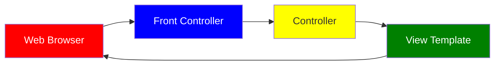

# Spring MVC

## Thymeleaf

- Java templating engine
- processed on the server

**Development Process**:

1. Add Thymeleaf to Maven POM file

```
<dependency>
<groupId>org.springframework.boot</groupId>
<artifactId>spring-boot-starter-thymeleaf</artifactId>
</dependency>
```

2. Develop Spring MVC Controller

```ts
@Controller
public class DemoController {
  @GetMapping("/")
  public String sayHello(Model theModel) {
    //theDate will match up with thymeleaf's theDate as well
    theModel.addAttribute("theDate", java.time.LocalDateTime.now());
    return "helloworld";
  }
}
```

3. Create Thymeleaf template

- thymeleaf location: `src/main/resources/templates`
- For web apps, Thymeleaf templates have a .html extension

```html
<!DOCTYPE html>
<html xmlns:th="http://www.thymeleaf.org">
  <head>
    ...
  </head>
  <body>
    <!-- theDate matches with the Controller's theDate -->
    <p th:text="'Time on the server is ' + ${theDate}" />
  </body>
</html>
```

## CSS and Thymeleaf

- @ symbol will reference context path of your application (app root)

1. Create CSS file

- File Location: `src/main/resources/static`

Example: **demo.css**

```css
.funny {
  font-style: italic;
  color: green;
}
```

2. Reference CSS in Thymeleaf template

```html
<head>
  <title>Thymeleaf Demo</title>
  <!-- reference CSS file -->
  <!-- @ symbol will reference context path of your application (app root) -->
  <link rel="stylesheet" th:href="@{/css/demo.css}" />
</head>
```

3. Apply CSS style

```html
<head>
  <title>Thymeleaf Demo</title>
  <!-- reference CSS file -->
  <link rel="stylesheet" th:href="@{/css/demo.css}" />
</head>

<body>
  <p th:text="'Time on the server is ' + ${theDate}" class="funny" />
</body>
```

## Spring Boot and Directories for Static Resources

Spring Boot will search following directories for static resources:

1. /META-INF/resources
2. /resources
3. /static
4. /public

## Spring MVC Behind the Scenes

- A set of web pages to layout UI components
- A collection of Spring beans (controllers, services, etc…)
- Spring configuration (XML, Annotations or Java)



### Spring MVC Front Controller

- Front controller known as DispatcherServlet
  - Part of Spring Framework
  - Already developed by Spring Dev Team

### Controller

- Code created by developer
- Contains your business logic
  - Handle the request
  - Store/retrieve data (db, web service…)
  - Place data in model
- Send to appropriate view template

### Model

- Model: contains your data
- Store/retrieve data via backend systems
  - database, web service, etc...
  - Use a Spring bean if you like
- Place your data in the model
  - Data can be any Java object/collection

### View Template

- Spring MVC is flexible
  - Supports many view templates
- Developer creates a page
  - Displays data

## Reading Form Data with Spring MVC

```js
@Controller
public class HelloWorldController {
  // need a controller method to show the initial HTML form
  @RequestMapping("/showForm")
  public String showForm() {
    return "helloworld-form";
  }

  // need a controller method to process the HTML form
  @RequestMapping("/processForm")
  public String processForm() {
    return "helloworld";
  }
}
```

**Development Process**:

1. Create Controller class

2. Show HTML form

- Create controller method to show HTML Form
- Create View Page for HTML form

3. Process HTML Form

- Create controller method to process HTML Form
- Develop View Page for Confirmation

## Adding Data to Spring Model

- Passing Model to the Controller

```js
@RequestMapping("/processFormVersionTwo")
public String letsShoutDude(HttpServletRequest request, Model model) {
  // read the request parameter from the HTML form
  String theName = request.getParameter("studentName");
  // convert the data to all caps
  theName = theName.toUpperCase();
  // create the message
  String result = "Yo! " + theName;
  // add message to the model
  model.addAttribute("message", result);

  ...

  // get the data
  String result = ...
  List<Student> theStudentList = ...
  ShoppingCart theShoppingCart = ...

  // add data to the model

  model.addAttribute("message", result);
  model.addAttribute("students", theStudentList);
  model.addAttribute("shoppingCart", theShoppingCart);
  return "helloworld";
}
```

- View Template

```html
<html>
  <body>
    Hello World of Spring! ... The message: <span th:text="“${message}”" />
  </body>
</html>
```

## Reading HTML Form Data with @RequestParam Annotation

```js
@RequestMapping("/processFormVersionTwo")
public String letsShoutDude(
  // Spring will read param from request: studentName
  @RequestParam("studentName") String theName, Model model) {
  // now we can use the variable: theName
}
```

## @GetMapping and @PostMapping

### Sending Data with GET method

- Form data is added to end of URL as name/value pairs
  - `theUrl?field1=value1&field2=value2...`

```html
<form th:action=“@{/processForm}” method="GET" …>
  ...
</form>
```

- Handling Form Submission

```js
@RequestMapping("/processForm")
public String processForm(...) {
  ...
}
```

- Or Handling Form Submission, constraining only to GET

```js
@GetMapping("/processForm")
public String processForm(...) {
...
}
```

### Sending Data with POST method

- Form data is passed in the body of HTTP request message

```html
<form th:action=“@{/processForm}” method="POST" ...>
  ...
</form>
```

- @PostMapping: This mapping ONLY handles POST method

```js
@PostMapping("/processForm")
public String processForm(...) {
  ...
}
```

## Spring Boot - Spring MVC Form Data Binding - Text Fields

https://github.com/darbyluv2code/spring-boot-3-spring-6-hibernate-for-beginners/tree/main/06-spring-boot-spring-mvc/07-form-data-binding-textfields

- **Data Binding**: automatically setting / retrieving data from a Java object / bean.
- Showing a Form
  - Within the Spring Controller,
    - there must be a _model attribute_ which is a bean that will hold form data for the data binding.
- Development Process Example:
  1. Create Student Class
  2. Create Student controller class
  3. Create HTML Form
  4. Create form processing code
  5. Create confirmation page

### Show Form - Add Model Attribute

**StudentController.java**

```js
@GetMapping("/showStudentForm")
public String showForm(Model theModel) {

    // create a student object
    Student theStudent = new Student();

    // add student object to the model
    // student is the model attribute name
    theModel.addAttribute("student", theStudent);

    return "student-form";
}
```

### Setting up HTML Form - Data Binding

```html
<!-- student is the name of the model attribute -->
<form th:action="@{/processStudentForm}" th:object="${student}" method="POST">
  <!-- When form is loaded, Spring MVC will read student from the model, then call: student.getFirstName() -->
  <!-- When form is submitted, Spring MVC will create a new Student instance 
      and add to the model, then call: student.setFirstName() -->
  First name: <input type="text" th:field="*{firstName}" />

  <br /><br />

  <!-- When form is loaded, Spring MVC will read student from the model, then call: student.getLastName() -->
  <!-- When form is submitted, Spring MVC will create a new Student instance 
      and add to the model, then call: student.setLastName() -->
  Last name: <input type="text" th:field="*{lastName}" />

  <br /><br />

  <input type="submit" value="Submit" />
</form>
```

- Refer to [Show Form - Add Model Attribute](/docs/tutorial/spring-mvc#show-form---add-model-attribute) code snippet as well.
- `th:object="${student}"` is the name of the model attribute.
  - Recall the name of the model attribute is defined as student: `theModel.addAttribute("student", new Student());`
- `*{...}` is shortcut syntax in thymeleaf. Examples:
  - `*{firstName}` means `${student.firstName}`
    - When the form is loaded, Spring MVC will read from the model: `student.getFirstName()`
    - When form is submitted, Spring MVC will create a new Student instance and add to the model: `student.setFirstName(…)`
  - `*{lastName}` means `${student.lastName}`
    - When the form is loaded, Spring MVC will read from the model: `student.getLastName()`
    - When form is submitted, Spring MVC will create a new Student instance and add to the model: `student.setLastName(…)`

### Handling Form Submission in the Controller

```js
// processStudentForm is used in thymeleaf too
// student is the model attribute name
@PostMapping("/processStudentForm")
public String processForm(@ModelAttribute("student") Student theStudent) {
    // log the input data
    System.out.println("theStudent: " + theStudent.getFirstName()
        + " " + theStudent.getLastName());
    return "student-confirmation";
}
```

```js
<html>
  <body>
    The student is confirmed:{" "}
    <span th:text="${student.firstName} + ' ' + ${student.lastName}" />
  </body>
</html>
```

- `${student.firstName}` calls `student.getFirstName()`
- `${student.lastName}` calls `student.getLastName()`

## Spring Boot - Spring MVC Form - Drop Down List

```html
<select th:field="*{country}">
  <option th:value="Brazil">Brazil</option>
  <option th:value="France">France</option>
  <option th:value="Germany">Germany</option>
  <option th:value="India">India</option>
</select>
```

- `th:value` is sent during form submission

**Development Process**:

1. Add list of countries to **application.properties** file

```
countries=Brazil,France,Germany,India,Mexico,Spain,United States
```

2. Inject the countries in the StudentController using @Value
3. Add the list of countries to the model

```js
@Controller
public class StudentController {
  // @Value grabs the countries list from the application.properties file
  @Value("${countries}")
  private List<String> countries;

  @GetMapping("/showStudentForm")
  public String showForm(Model theModel) {
    ...

    // add the list of countries to the model
    theModel.addAttribute("countries", countries);

    return "student-form";
  }
}
```

4. In HTML form, generate list of `<option>` tags for the countries.

```html
<!-- Loop over the list of countries -->
<!-- tempCountry is sent as the th:value during form submission and is also displayed in the UI as th:text-->
<select th:field="*{country}">
  <option
    th:each="tempCountry : ${countries}"
    th:value="${tempCountry}"
    th:text="${tempCountry}"
  ></option>
</select>
```

## Spring MVC Form - Radio Buttons

```html
<input type="radio" th:field="*{favoriteLanguage}" th:value="Go">Go</input>
<input type="radio" th:field="*{favoriteLanguage}" th:value="Java">Java</input>
<input type="radio" th:field="*{favoriteLanguage}" th:value="Python">Python</input>
```

- `th:field` binds to property on Student object
- `th:value` is sent during form submission

**Development Process**:

1. Add list of languages to **application.properties** file

```
languages=Go,Java,Python,Rust,TypeScript
```

Then, update **StudentController.java**,

```js
@Value("${languages}")
private List<String> languages;

...
@GetMapping("/showStudentForm")
public String showForm(Model theModel){
  // create a student object
  Student theStudent = new Student();

  // add the list of languages to the model
  theModel.addAttribute("languages", languages);

  return "student-form";
}
```

2. Update HTML form

**student-form.html**

```html
Favorite Programming Language:

<input
  type="radio"
  th:field="*{favoriteLanguage}"
  th:each="tempLang : ${languages}"
  th:value="${tempLang}"
  th:text="${tempLang}"
/>
```

3. Update Student class - add getter/setter for new property

**Student.java**

```js
public class Student {
  private string favoriteLanguage;

  ...

  //generate getters and setters
}
```

4. Update confirmation page

**Student-confirmation.html**

```html
Favorite Programming Language: <span th:text="${student.favoriteLanguage}" />
```

## Spring MVC Forms - Check Box

```html
<input type="checkbox" th:field="*{favoriteSystems}" th:value="Linux">Linux</input>
<input type="checkbox" th:field="*{favoriteSystems}" th:value="macOS">macOS</input>
<input type="checkbox" th:field="*{favoriteSystems}" th:value="'Microsoft Windows'">Microsoft Windows</input>
```

**Development Process**:

1. Add list of systems to **application.properties** file

```
systems=Linux,macOS,Microsoft Windows,Android OS, iOS
```

2. Inject the systems in the StudentController using @Value

```js
@Value("${systems}")
private List<String> systems;

...

@GetMapping("/showStudentForm")
public String showForm(Model theModel){
  ...

  // add the list of languages to the model
  theModel.addAttribute("systems", systems);

  return "student-form";
}

```

**StudentController.java**

3. Update HTML form

**student-form.html**

```html
Favorite Operating Systems:

<input
  type="checkbox"
  th:field="*{favoriteSystems}"
  th:each="tempSystem : ${systems}"
  th:value="${tempSystem}"
  th:text="${tempSystem}"
/>
/>
```

4. Update Student class - add getter/setter for new property

**Student.java**

```js
public class Student {
  private List<String> favoriteSystems;

  ...

  //generate getters and setters
}
```

5. Update confirmation page

**student-confirmation.html**

```html
Favorite Operating Systems:

<ul>
  <li
    th:each="tempSystem : ${student.favoriteSystems}"
    th:text="${tempSystem}"
  />
</ul>
```

## Spring MVC Form Validation

- Java has a standard Bean Validation API
- Defines a metadata model and API for entity validation
- Spring Boot and Thymeleaf also support the Bean Validation API
- Validation Feature
  - required
  - validate length
  - validate numbers
  - validate with regular expressions
  - custom validation

Road map:

1. set up our development environment

- Spring Initializer Website
- dependencies:
  - Spring Web
  - Thymeleaf
  - Validation
  - Spring Boot DevTools

2. required field
3. validate number range: min, max
4. validate using regular expression (regexp)
5. custom validation

## Spring MVC Form Validation Required Fields

**Development Process**:

1. Create Customer class and add validation rules

```js
import jakarta.validation.constraints.NotNull;
import jakarta.validation.constraints.Size;

public class Customer {
  private String firstName;

  // use jakarta, not org.jetbrains
  // validation rules
  @NotNull(message = "is required")
  @Size(min=1, message = "is required")
  private String lastName = “”;

  // getter/setter methods ...
}
```

**CustomerController.java**

2. Add Controller code to show HTML form

```js
import org.springframework.stereotype.Controller;
import org.springframework.web.bind.annotation.GetMapping;
import org.springframework.ui.Model;

@Controller
public class CustomerController {
  //Model allows us to share information between Controllers and view pages (Thymeleaf)
  @GetMapping("/")
  public String showForm(Model theModel) {
    theModel.addAttribute("customer", new Customer());
    return "customer-form"; //maps to customer-form.html
  }
  ...
}
```

3. Develop HTML form and add validation support

**customer-form.html**

```html
<!-- processForm is where to submit form data -->
<!-- customer is model attribute name -->
<form th:action="@{/processForm}" th:object="${customer}" method="POST">
  <!-- Property name from Customer class -->
  First name: <input type="text" th:field="*{firstName}" /> <br /><br />

  <!-- Property name from Customer class -->
  Last name (*): <input type="text" th:field="*{lastName}" />

  <!-- Show error message (if present) -->
  <!-- th:if will check if error message shows up for lastName -->
  <!-- th:errors will display error message for lastName -->
  <span
    th:if="${#fields.hasErrors('lastName')}"
    th:errors="*{lastName}"
    class="error"
  ></span>

  <br /><br />

  <input type="submit" value="Submit" />
</form>
```

4. Perform validation in the Controller class

**CustomerController.java**

```js
@PostMapping("/processForm")
public String processForm(
  // @Valid will tell Spring MVC to perform validation
    //these validation rules are defined in step 1 within the Customer class
  // customer is the Model attribute name
  // theBindingResult is the results of validation
  @Valid @ModelAttribute("customer") Customer theCustomer, BindingResult theBindingResult) {
  if (theBindingResult.hasErrors()) {
    //if there is an error in validating the required validation of last name, then return to customer form
    return "customer-form";
  }
  else {
    //successfully validated the last name, show confirmation page
    return "customer-confirmation";
  }
}
```

5. Create confirmation page

**customer-confirmation.html**

```html
<!DOCTYPE html>
<html xmlns:th="http://www.thymeleaf.org">
  <body>
    The customer is confirmed:
    <span th:text="${customer.firstName + ' ' + customer.lastName}" />
  </body>
</html>
```

## Spring MVC Validation @InitBinder

- Need to trim whitespace from input fields
- whitespace should results in fail and not passes.

### @InitBinder

- **@InitBinder** is a pre-processor
- It will pre-process each web request to our controller
- Method annotated with **@InitBinder** is executed
- **@InitBinder** will trim Strings.
  - If String has white spaces (leading or trailing white space), trim it to `null`

### Register Custom Editor in Controller

**CustomerController.java**

```js
// @InitBinder will pre-process all web requests coming into the Controller
@InitBinder
public void initBinder(WebDataBinder dataBinder) {
  // StringTrimmerEditor is defined in Spring API
  // StringTrimmerEditor removes whitespace, both leading and trailing
  // set to value true to trim until it's a null object
  StringTrimmerEditor stringTrimmerEditor = new StringTrimmerEditor(true);
  dataBinder.registerCustomEditor(String.class, stringTrimmerEditor);
}
```

## Spring MVC Validation Number Range: @Min and @Max

**Development Process**:

1. Add validation rule to Customer class

```js
import jakarta.validation.constraints.Min;
import jakarta.validation.constraints.Max;

public class Customer {
  ...

  @Min(value=0, message="must be greater than or equal to zero")
  @Max(value=10, message="must be less than or equal to 10")
  private int freePasses;
  // getter/setter methods
}
```

2. Display error messages on HTML form

**customer-form.html**

```html
Free passes: <input type="text" th:field="*{freePasses}" />

<span
  th:if="${#fields.hasErrors('freePasses')}"
  th:errors="*{freePasses}"
  class="error"
></span>
```

3. Perform validation in the Controller class

- Continuing from earlier examples, keep the `processForm` step alone (keep it the same)
- The previous code for `processForm` already covers this step.

4. Update confirmation page

**customer-confirmation.html**

```html
Free passes: <span th:text="${customer.freePasses}" />
```

## Spring MVC Validation Regular Expressions

https://docs.oracle.com/javase/tutorial/essential/regex/

- A sequence of characters that define a search pattern
  - This pattern is used to find or match strings

**Development Process**:

1. Add validation rule to Customer class

```js
import jakarta.validation.constraints.Pattern;
public class Customer {
  ...

  @Pattern(regexp="^[a-zA-Z0-9]{5}", message="only 5 chars/digits")
  private String postalCode;

  // getter/setter methods
}
```

2. Display error messages on HTML form

**customer-form.html**

```html
Postal Code: <input type="text" th:fields="*{postalCode}" />

<span
  th:if="${#fields.hasErrors('postalCode')}"
  th:errors="*{postalCode}"
  class="error"
></span>
>
```

3. Update confirmation page

**customer-confirmation.html**

```html
Postal Code: <span th:text="${customer.freePasses}" />
```

## Spring MVC Validation Make an Integer Field Required

**Development Process**:

1. Add an additional validation rule to freePasses in Customer class

**Customer.java**

```js
  ...

  @NotNull(message="is required")
  @Min(value=0, message="must be greater than or equal to zero")
  @Max(value=10, message="must be less than or equal to 10")
  private Integer freePasses;

  // remember to update the getter/setter methods
```

## Spring MVC Validaton - Strings for Int Fields and Custom Messages

1. Create customer error message in the correct resource location

**src/main/resources/message.properties**

```
typeMismatch.customer.freePasses=Invalid number
```

- typeMismatch is an Error type
- customer is the Spring model attribute name
- freePasses is the field name
- Invalid number is the custom message, (you could say anything besides Invalid number)

## Spring MVC Validation - Debugging Tips for Customer Error Names

- In the `CustomerController`, inspect the binding result object by printing it out

```js
System.out.println("Binding Results: " + theBindingResult.toString());
```

## Spring MVC Validation Custom Validation

- Custom validation returns boolean value for pass/fail (true/false)

**Development Process**:

1. Create custom validation rule

- Create `@CourseCode`annotation

  :::note
  In IntelliJ, when creating a new Java Class file, select **Annotation**.
  :::

  - `@interface` syntax defines a custom annotation
  - `@Constraint` brings in the helper class with the validation logic
  - `@Target` allows the custom annotation to be applied to a method or field
  - `@Retention` retain this annotation in the Java class file and to process it at runtime

  **CourseCode.java**

  ```js
  import jakarta.validation.Constraint;

  import java.lang.annotation.ElementType;
  import java.lang.annotation.Retention;
  import java.lang.annotation.RetentionPolicy;
  import java.lang.annotation.Target;

  @Constraint(validatedBy = CourseCodeConstraintValidator.class)
  @Target( { ElementType.METHOD, ElementType.FIELD } )
  @Retention(RetentionPolicy.RUNTIME)
  public @interface CourseCode {
    // developer puts in value, otherwise default value is "LUV"
    public String value() default "LUV";
    // developer puts in message, otherwise default message is as defined below
    public String message() default "must start with LUV";

    // Groups: can group related constraints
    public Class<?>[] groups() default {};

    // Payloads: provide custom details about validation failure (severity level, error code, etc)
    public Class<? extends Payload>[] payload() default {};
  }
  ```

- Create `CourseCodeConstraintValidator`, which is a helper class to assist in validation

**CourseCodeConstraintValidator.java**

```js
import jakarta.validation.ConstraintValidator;
import jakarta.validation.ConstraintValidatorContext;

//helper class that contains business rules for validation
public class CourseCodeConstraintValidator implements ConstraintValidator<CourseCode, String> {
  private String coursePrefix;

  @Override
  public void initialize(CourseCode theCourseCode) {
    coursePrefix = theCourseCode.value();
  }

  // Spring MVC will call isValid(...) at runtime
  // theCode is HTML form data entered by the user
  // theConstraintValidatorContext is the helper class for additional error messages
  // returns true or false if the given string is validated
  @Override
  public boolean isValid(String theCode, ConstraintValidatorContext theConstraintValidatorContext) {
    boolean result;

    if (theCode != null) {
      // in this example, does this course prefix start with "LUV"
      result = theCode.startsWith(coursePrefix);
    }
    else {
      // the course code is not a required field
      result = true;
    }
      return result;
    }
}
```

2. Add validation rule to Customer class

**Customer.java**

```js
public class Customer {
  ...
  // add in our custom @CourseCode annotation
  @CourseCode(value="ANYTHING_YOU_WANT", message="must start with ANYTHING_YOU_WANT")
  private String courseCode;

  //generate getters and setters
}
```

3. Display error messages on HTML form

**customer-form.html**

```html
Course Code: <input type="text" th:fields="*{courseCode}" />

<span
  th:if="${#fields.hasErrors('courseCode')}"
  th:errors="*{courseCode}"
  class="error"
></span>
>
```

4. Update confirmation page

**customer-confirmation.html**

```html
Course Code: <span th:text="$customer.courseCode}"></span>
```
